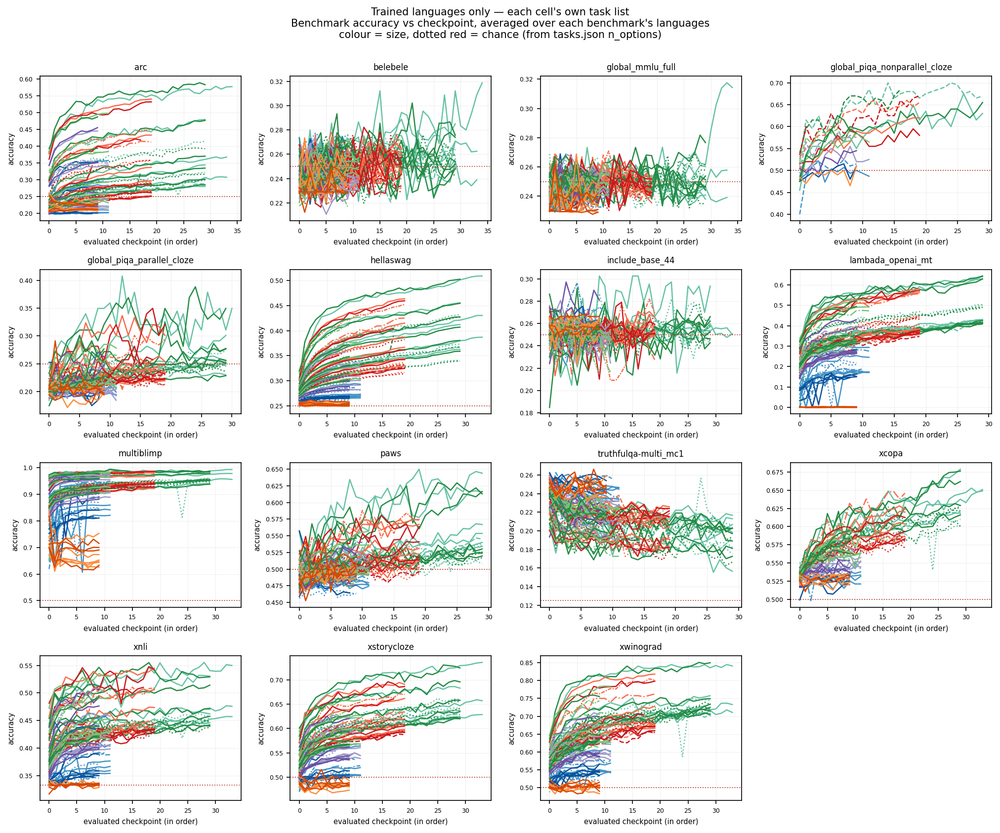

# Signal-Aware Multilingual Evaluation on a Small-to-Large Predictivity Ladder

**María Grandury** — École Polytechnique Fédérale de Lausanne (EPFL) · Research report, 4 September 2026 · branch `feat/snr-update`

## Abstract

Training multilingual language models requires repeated design decisions — data mixtures, architectures, tokenizers — that are made on small proxy models and evaluated on benchmark suites whose reliability degrades outside English. We extend the Signal-and-Noise framework of Heineman et al. (2025) to a controlled multilingual ladder: six model sizes (90M–1.7B non-embedding parameters), seven language settings (1 to 100 languages at a fixed 50 % English share), two intervention axes (model depth and language-set scheme) and seed replicates, each rung trained to five times its Chinchilla-optimal budget and scored on per-language bits-per-byte (BPB) on a fixed validation set and on up to 463 harness tasks. This report records the analysis pipeline built for that ladder, the research questions it answers, and the findings already established on the ≤ 600M rungs. The analysis reads one published artefact, the per-checkpoint ladder report, so every number regenerates from the same file; the results blocks of the per-question reports fill in as the reference rungs land.

## 1. Introduction

Pretraining a multilingual model is a sequence of decisions taken on proxies: a smaller model, an earlier checkpoint, a cheaper benchmark. Each proxy is only useful if it ranks the alternatives the way the model that ships would. Heineman et al. (2025) showed, on the English DataDecide ladder, that a benchmark's *signal-to-noise ratio* — the dispersion of scores across model variants against the variability of a single run's late checkpoints — predicts both *decision accuracy* (the agreement between the small-model and the large-model ranking) and *scaling-law error*. Our earlier work (Grandury, 2026) carried the framework to a 36-model multilingual sweep over three data mixtures and 12 languages and found that the dispersion family of SNR definitions transfers across seeds, that the above-random gate removes most translated knowledge benchmarks at sub-1B scale, and that language and subject subsets can beat full benchmarks.

That sweep left the question the multilingual practitioner actually asks unanswered: **at a given number of languages, which model sizes can stand in for the large one when a design choice must be ranked, and how does the answer move as languages are added?** The predictivity ladder (Section 4) was built for that question. This report documents:

1. the pipeline that turns the ladder's published per-checkpoint table into the seven analyses of Section 5, with the logical fixes that surfaced while adapting it (Section 5.8);
2. the findings that are already established on the trained rungs (Section 6);
3. the threats to validity the design carries (Section 7) and the plan to the paper (Sections 8–9).

**Research questions.** RQ1 Which multilingual benchmarks produce model rankings at small scale that hold at larger scale? RQ2 Can a benchmark metric computed at small scale (an SNR) predict that decision accuracy, removing the need to evaluate the large model? RQ3 Which benchmark design choices lead to higher reliability? RQ4 — new — which proxy sizes rank an intervention like the reference at each language count, and does per-language BPB agree with the benchmarks about it?

## 2. Related work

**Benchmark reliability.** Heineman et al. (2025) define signal as the relative dispersion of scores across models and noise as their variability across late checkpoints, and show that high-SNR benchmarks better preserve rankings and reduce scaling-law error; they validate checkpoint noise against seed re-runs on DataDecide (Magnusson et al., 2025), the 25-recipe × 4-size ladder we compare against in RQ3. Madaan et al. (2024) quantify evaluation variance from seeds and prompts; Polo et al. (2024) and item-response approaches show that small informative subsets can replace full benchmarks — the subset question of our RQ4. Schaeffer et al. (2024) explain why downstream capabilities are hard to predict from scale: emergent, multiple-choice metrics degrade the monotone signal that per-token losses carry, which is why the ladder's outcome metric is BPB and the benchmarks are the secondary signal.

**Scaling ladders.** The OLMo compute-efficient ladder (Bhagia et al., 2024) fixes non-embedding sizes and trains each rung at a multiple of the Chinchilla-optimal budget (Hoffmann et al., 2022), then predicts task scores through a two-step fit; the ladder here follows its size convention and its 5×C budget. Hägele et al. (2024) show that warmup-stable-decay schedules give properly annealed endpoints at several budgets from one run, which is how we propose to test whether 5×C is the right budget at high language counts (Section 8). Choshen et al. (2024) catalogue the ways scaling-law fits go wrong with few points — our per-language fits use four to five rungs and are read as prediction error, not as laws.

**Multilingual scaling.** The "curse of multilinguality" (Conneau et al., 2020) and its later quantification (Chang et al., 2024) describe the per-language cost of adding languages at fixed capacity; ATLAS-style multilingual scaling laws put the compute-optimal tokens-per-parameter ratio well above 20 as the language count grows, which motivates both the fixed 50 % English share and the open budget question. Benchmark coverage across the ladder's 100 languages comes from Belebele (Bandarkar et al., 2024), Global-MMLU (Singh et al., 2025), INCLUDE (Romanou et al., 2025), Global PIQA (Chang et al., 2025), MultiBLiMP (Jumelet et al., 2026), IrokoBench (Adelani et al., 2025) and the classic XNLI / XStoryCloze / XCOPA / XWinograd / PAWS-X families; their provenance (human vs machine translation, native authoring, template generation) is the design axis of RQ5.

## 3. The framework

For a benchmark *b* and a model size *s*, let *mj* be the final score of design variant *j* and *ct* the score of the reference run at late checkpoint *t*.

- **Signal** = maxj,k |mj − mk| / m̄ — the relative dispersion across variants (the "mean pairwise distance" and 20 other variants in `snr/snr_variants.py` replace the max by other spread statistics).
- **Noise** = σt(ct) / c̄ over the last *N* = 5 checkpoints; on the ladder also the sample std over seed replicates where the ×3 cells exist.
- **SNR** = Signal / Noise.
- **Decision accuracy** = the fraction of variant pairs ordered the same way at the proxy and at the reference (`decision_acc_fast`); **DA-size** compares sizes at their final checkpoints, **DA-ckpt** an early checkpoint (20/40/60/80 % of the run) to the final one within a size.
- **Scaling-law error** = the relative error of the reference's per-language BPB predicted by a power law log BPB = a − α log N fitted on the proxy rungs.
- **Above-random gate**: a (benchmark, size) cell enters SNR only if its mean score beats 1/noptions by 0.05; it depends on raw scores and the option counts only.

The ladder adds one construct: **intervention decision accuracy** over a population of items. With two levels of an intervention (deep vs shallow; scheme A vs B) the pairwise definition reduces to sign agreement of the level difference between proxy and reference, and the population is the set of per-language BPB values (or benchmark tasks) the two levels share.

## 4. Experimental design

Figure 1. The predictivity ladder: language settings (rows) × non-embedding sizes (columns); each cell lists scheme, architecture and seeds. 62 runs at one intervention level, 162 with both architectures and scheme B where its language set differs.

| | 90M | 175M | 350M | 600M | 1B | 1.7B |
|---|---|---|---|---|---|---|
| Layers × dmodel (deep) | 15 × 768 | 16 × 1024 | 20 × 1280 | 24 × 1536 | 28 × 1792 | 30 × 2304 |
| Layers × dmodel (shallow) | 8 × 1024 | 10 × 1280 | 14 × 1536 | 14 × 2048 | 17 × 2304 | 20 × 2816 |
| Tokens (D = 100·N) | 9.3B | 17.6B | 34.4B | 59.5B | 94.4B | 167.2B |
| Checkpoints saved / evaluated | 20 / 10 | 20 / 10 | 20 / 10 | 20 / 10 | 40 / 20 | 60 / 30 |
| Language settings | all 7 | all 7 | all 7 | all 7 | all 7 | 1, 2, 8, 30, 100 |
| Seeds | 1 | 3 at L ∈ {1, 2, 50, 100} | 1 | 3 at L ∈ {1, 2, 50, 100} | 3 at L ∈ {1, 2, 30} | 1 |

**Models.** Sizes are non-embedding parameters (Bhagia et al., 2024); the 131k Apertus vocabulary would otherwise dominate the small rungs. Deep and shallow ladders share layer structure (head dim 64, FFN ×4, GQA 4) and differ only in aspect ratio (width/depth ≈ 64 vs ≈ 128) at equal N (±5 %). AdEMAMix, WSD schedule (4 % warmup, 20 % decay), peak learning rate from the 6ND law at each run's own budget, width-scaled init, GBS 504 × 4096 tokens.

**Data.** English from DCLM-edu, the other languages from FineWeb-2-HQ; every multilingual setting is 50 % English, the rest allocated at temperature T = 1 across the setting's languages. Scheme A takes the top-(L−1) FineWeb-2 subsets by bytes (the L100 list swaps eight benchmark-less subsets for the next ones with ≥ 2 benchmark families); scheme B replaces the small settings with script- and family-diverse picks, so the two schemes differ only at L ∈ {8, 15, 30}. Lists are nested across settings.

**Outcome metrics.** Per-language BPB on a fixed validation set (5M tokens per language, carved out of the first file of every subset and excluded from training) scored on every saved checkpoint; the `auto` benchmark group of the swiss-ai `lm-evaluation-harness` fork intersected with each cell's trained languages (15 tasks at L1, 463 at L100), evaluated on every second saved checkpoint and the final one. Every checkpoint is converted to Hugging Face format; the ladder's compute axis is 6 × (Nnon-emb + d·V) × D.

**Source of truth.** `src/pretrain/ladder_report.py` builds one wide table — one row per checkpoint, one column per measurement — from the training logs, the harness results and the BPB files, and publishes it to the Hugging Face dataset `msnr-data/ladder-report`. The analysis package loads that file (downloading it on first use), melts it into a long (model, checkpoint, task) frame in which per-language BPB is a task like any benchmark, drops diverged and unfinished runs, and restricts checkpoints to the grid every size shares so that the late-window noise spans the same fraction of training at every rung.

## 5. Analyses

Each research question is one directory under `src/signal-and-noise/analysis/`, read results-first; `run_all_predictivity.sh` runs them in dependency order and rewrites the results blocks of every README. The status column says what exists today.

| RQ | question | method | inputs | status |
|---|---|---|---|---|
| RQ0 | How do scores move with compute across language settings and sizes; which benchmarks clear chance? | score vs FLOPs curves per language setting and size; the above-random gate from `n_options` | ladder report | pipeline ready; gate results in Section 6 |
| RQ1 | Does a benchmark rank the design variants at a small size / early checkpoint like the reference? | DA-size for every bucket pair (90M→175M … 1B→1.7B); DA-ckpt at 20/40/60/80 % | ladder report | pipeline ready; recipe-ranking DA in Section 6 |
| RQ2 | Which of 22 SNR definitions predicts DA, per language; does it survive a seed swap? | per-language Pearson r of log SNR vs DA; seed holdout on the ×3 cells; variant families | rq01 tables | pipeline ready |
| RQ3 | Does our SNR agree with AllenAI DataDecide on the shared English tasks? | Pearson r / Spearman ρ over the shared tasks at matched sizes (90M↔90M … 1B↔1B) | rq02 + DataDecide | pipeline ready; shared universe is 4 tasks |
| RQ4 | Can a language or subject subset beat the full benchmark's SNR? | cumulative subset sweep ordered by standalone SNR, random-order baseline; now over 100-language families and the BPB family | ladder report | pipeline ready |
| RQ5 | Which design features predict SNR? | Kruskal–Wallis over curation, format, option count, passage; 17 families with provenance | rq02 tables | pipeline ready |
| RQ6 | Which proxy sizes rank an intervention like the reference at each L? | intervention DA over per-language BPB / benchmarks; per-language BPB scaling-law error; effect vs seed and checkpoint noise | ladder report | new; pipeline ready |

### 5.1 RQ0 — curves and the above-random gate

Score-vs-FLOPs curves per benchmark family, one line per language setting and size, with the per-setting "signal" bracket at the target size; and the gate: a (benchmark, size) cell is above random iff its mean final score beats chance by 0.05, where chance comes from the option counts derived from the evaluated samples (`configs/tasks.json`) with a per-family fallback. Per-language BPB and generative tasks have no chance level and are never gated. Every downstream SNR cell that fails the gate is set to NaN, so the gate propagates to all RQs and never depends on any of them.

### 5.2 RQ1 — decision accuracy

The truth the rest is scored against. Models are the ladder's cells; the cross-size identity is the cell's design variant (language setting, scheme, architecture, seed), so a variant trained at two sizes is one pair. DA-size compares final checkpoints between every bucket pair with ≥ 2 shared variants; DA-ckpt compares the checkpoint nearest 20/40/60/80 % of a run to its final one. Multilingual tasks are evaluated only on cells that train the language, so each task's population is the variants that exist at both sizes *and* were evaluated on it; `n` is reported with every value.

### 5.3 RQ2 — the SNR definition

Twenty-two variants of the SNR (dispersion, relative-spread, discrepancy, robust and depth families) computed per (task, size) from the variants' final scores and the late-checkpoint noise, correlated per language with DA-size and DA-ckpt as Pearson r of log10 SNR. The seed holdout trains the variant ranking on seeds 64/313 of the ×3 cells and tests it on seed 1904 of the same cells; only a ranking that survives the swap is reported as a recommendation, and at the family level, since the 36-sweep showed the exact argmax never transfers.

### 5.4 RQ3 — agreement with DataDecide

Cross-corpus Pearson r and Spearman ρ of log SNR over the English tasks both corpora evaluate, at matched sizes; on the ladder the shared universe is `arc_easy`, `arc_challenge`, `hellaswag` and MMLU (through the Global-MMLU English split), so the read is indicative. DataDecide's "signal" is a dispersion over 25 data recipes; ours is over language settings and schemes, a narrower axis — a low correlation says the populations differ before it says the definition does.

### 5.5 RQ4 — subsets

For each multilingual family the per-language tasks are ranked by standalone SNR and cumulative subsets swept; the best subset and its gain over the full set are recorded per size, with a random-order baseline. On the ladder the families span up to 100 languages, and the per-language BPB family is swept the same way: which languages' BPB make the sharpest macro-average.

### 5.6 RQ5 — benchmark design

Per-family SNR (median over its per-language tasks) grouped by curation method, source origin, task format, option count and a reading-passage flag, tested with a family-level Kruskal–Wallis; seventeen families with provenance, including the natively-sourced INCLUDE and Global PIQA and the human-translated IrokoBench families the ladder adds.

### 5.7 RQ6 — proxy predictivity (new)

Three reads over the (proxy size, L) grid. (i) *Intervention DA*: for each L, the reference is the largest size trained there; for each smaller size, DA is the fraction of population items — per-language BPB on the languages both levels train, all 100 validation languages, the benchmark tasks, or the single macro-BPB decision — on which the proxy agrees with the reference about which level is better. (ii) *Scaling-law error*: per language, log BPB = a − α log N fitted on the proxy rungs up to a ladder top predicts the reference's BPB; the relative error per ladder top says how far up the ladder one must train before the reference is predicted within a given tolerance. (iii) *Effect vs noise*: every decision's |Δ| against the seed noise (sample std over replicates) and the late-checkpoint noise (raw and detrended, because under WSD the final window is still descending); a decision inside the noise is a coin flip whatever its DA — the plan's own caveat, and the per-task version of the "read this against the seed row" rule of the ladder report.

### 5.8 What changed in the code

The 36-sweep pipeline read a per-(model, checkpoint, task) parquet built from the cluster's eval logs; the ladder pipeline reads the ladder report. The adaptation kept every analysis script and changed the inputs: a loader for the wide table, pool definitions whose member filters apply to the ladder's axes, task metadata from `configs/tasks.json` (116 languages instead of a 12-entry map), the gate keyed on option counts with a fallback, and reference sizes that fall back to the largest rung with data while the big rungs train. Logical fixes found on the way: the analysis configuration had lost the checkpoint-DA fractions and the size buckets (the package failed at import); the documented FLOPs convention was not implemented; the ladder report mislabelled trained languages (an iso3-prefix comparison against iso2 codes) and read the BPB files unguarded; the models registry lacked the scheme-B cells and the 1B row's adopted seeds; and the auto-eval watchers' due rule (`iter % (2 × interval)`) could never mark the 1B cells trained on the older 2,287-iteration grid as due, so those cells would never have been evaluated. Details are in the branch's commit messages.

## 6. Preliminary findings

All numbers in this section come from the cluster snapshots of 1–3 September 2026 (`plan/status-09-01.md`, `src/pretrain/ladder_report.md`), i.e. from the ≤ 600M rungs; the pipeline of Section 5 regenerates and extends them once the ladder report is published.

Figure 2. Final training loss vs non-embedding parameters per language setting, every architecture and scheme overlaid and fitted separately on the larger rungs; the red rings mark rungs off the fit — every 90M cell.

**The 90M rung is not on the ladder.** Nine of ten 90M runs reach their best loss at 15–19 % of training and degrade to +1.2…+1.9 nats above it; held-out BPB rises with training (English 1.68 → 1.95, Russian 1.17 → 1.45 between 10 % and 100 % of the run). The cause is an optimizer timescale fixed in steps (AdEMAMix β3, 10,000 steps) on runs whose length spans 18× across the ladder: the 90M run is shorter than the optimizer's memory. A control with β3 tied to the run length removes the divergence (final loss 5.762 → 2.778 at 90M-L2) and even beats the uncorrected 175M, which suggests the 175M rung is depressed too. The decision is not to retrain: the loader drops diverged runs and the ladder is reported with and without the rung.

**Above 90M, scaling behaves.** Final loss falls monotonically with size at every L (175M → 350M → 600M: 3.16 → 2.73 → 2.59 at L1; 3.16 → 2.71 → 2.53 at L50), the per-L power-law residuals of the healthy rungs sit within ±0.08 nats, and macro BPB over the 100 validation languages falls with size and with L (600M: 1.68 at L1, 1.60 at L15, 1.45 at L30, 1.30 at L50).

**Adding languages is free for English and cheap for the rest.** English BPB is identical between L2 and L50 at every size (0.947 vs 0.946 at 350M) while L50 beats L2 on 81–89 of the 99 non-English languages by ~0.4–0.5 bits/byte, against a checkpoint noise of ~0.002. Per-language spread at 350M-L50 runs from ≈ 0.55 (Tamil, Thai, Bengali, Georgian, Malayalam) to ≈ 2.7 (Somali, Maltese, Kurmanji, Uzbek, Welsh).

Figure 3. Benchmark accuracy over evaluated checkpoints, averaged over each family's languages, one colour family per size; dotted red = chance.

**Benchmarks split into emerged and at-chance.** MultiBLiMP grows from 0.65 to 0.92 (chance 0.5) from 90M to 600M, HellaSwag 0.25 → 0.30, XNLI 0.33 → 0.42, XStoryCloze 0.48 → 0.57, XWinograd 0.51 → 0.64 and XCOPA grow with size; Belebele, Global-MMLU, INCLUDE and ARC-multilingual sit at 0.24–0.26 (chance 0.25) up to 600M. The gate therefore removes the knowledge-heavy 4-option families at these sizes, as it did on the 36-sweep, where the external 270M–70B models cleared 122 of 124 benchmarks — the penalty is a capability artefact of the small rungs, not a property of the benchmarks.

**Decision accuracy from the recipe ranking.** Ranking the language-count recipes (L1 … L50) by final score at a small size against 600M over the 60 benchmarks with ≥ 4 recipes in common: HellaSwag is the most decision-reliable family (mean DA 0.72; 0.91 deciding from 350M; `hellaswag_de` 0.94), XWinograd and ARC-it reach 0.78, while the Global-MMLU family (0.48), several INCLUDE / Belebele / XNLI variants and `multiblimp_spa` (0.22) are at or below the coin flip — a benchmark at chance has nothing to rank. DA improves with the deciding size for the emerged families (HellaSwag 0.52 → 0.91 from 90M → 350M) and not for the chance-level ones. With 4–6 recipes DA is quantised to 6–15 pairs, so family averages are the trustworthy read.

**Which transformations make a different model.** At 600M the across-L range of final benchmark scores has median 0.022 ≈ 4.4× the checkpoint noise (56 of 60 benchmarks above 2×; `xwinograd_en` 17×, `hellaswag_ru` 13×); on BPB the separation is one to two orders of magnitude. The depth intervention is thinner: on the only clean matched pair with benchmarks on both sides (175M-L2) the median |Δ| is 0.013 ≈ 5.7× checkpoint noise, above 2× on 14 of 17 tasks, and 0.074 bits/byte on BPB (deep better on average by 0.084). The ladder report's six seed pairs put the seed effect at |Δ final loss| ≤ 0.043, |Δ macro BPB| ≤ 0.024 and |Δ mean benchmark| ≈ 0.013 — the same order as the depth effect on benchmarks. Whether deep vs shallow is a distinct model for SNR is therefore a per-task question, which is exactly what RQ6's effect-vs-noise table answers.

## 7. Threats to validity

- **Noise window under WSD.** The late-checkpoint noise is measured over the last five saved checkpoints, i.e. the final 25 % of a 20-checkpoint run, inside the decay phase where the loss is still falling; the raw std therefore contains trend. RQ6 reports a detrended std and, on the ×3 cells, the seed std; the shared checkpoint grid keeps the window the same fraction of training at every size (the 1B row is read on the k/20 subset).
- **Reference rungs.** Until 1.7B trains, 1B is the reference at every L; 1.7B is absent at L ∈ {15, 50} by design. Every RQ6 cell names its reference.
- **Sampling temperature.** At T = 1 the FineWeb-2 half of L100 gives 66 of 99 languages under 10M tokens at 90M and the smallest language 0.8M tokens even at 1B; a per-language SNR near zero there is a property of the mixture, not of the benchmark. The plan's recommendation is T = 2 sweep-wide (which repeats no data); until then per-language claims at L100 are restricted to languages above a token floor.
- **Coverage.** Every trained language has at least one benchmark family, but 16 have exactly one and for five of them it is a grammaticality probe (MultiBLiMP); INCLUDE v2 in multiple-choice form is the best single addition.
- **Few points per fit.** Per-language scaling fits use three to five rungs; they are reported as prediction error at a stated ladder top, never as scaling laws.
- **Quantised DA.** With two-level interventions and few variants per size, DA cells are coarse; the reported `n` and the effect-vs-noise ratio must be read with every value.

## 8. Plan

1. Publish the ladder report (`ladder_report.py --plot --publish --push-hf`) as the ≤ 600M evals land; run `run_all_predictivity.sh`; commit the regenerated READMEs and figures (git-lfs).
2. Decide T (2 vs 1 plus a token floor), rebuild the L100 mixture, resume the stalled 1B cells and start 1.7B; the watchers now pick up the adopted 1B cells.
3. Test whether 5×C is the right budget at L ≥ 30 with 12 WSD cooldown branches (350M/600M × L ∈ {1, 30, 100} × f ∈ {0.25, 0.5}), after the cheap check that the multilingual loss bend is not driven by data-starved tail languages.
4. Wire INCLUDE v2 (multiple-choice form) and switch or drop LAMBADA-MT; derive option counts for the newly wired tasks.
5. Write the paper on the ≤ 600M ladder while 1B/1.7B serve as the extrapolation check.

## 9. Proposed new and improved research questions

- **Seed noise as the primary noise (RQ2).** Heineman et al. use checkpoint noise as a proxy for seed noise; the ×3 cells make the real thing measurable at two sizes and four language counts. Report the SNR-variant ranking under both noises and the ratio between them per family — if the ratio depends on the family (as WSD trend suggests), the checkpoint-noise shortcut is family-specific and the paper should say so.
- **Matched-compute decisions (RQ6).** Decision accuracy at equal FLOPs rather than equal fraction of training (the IsoFLOP slices at 1e19 / 3.2e19 / 1e20 carry three to four sizes each; the milestone-eval rule is decided but not implemented). The practitioner's question is "given this budget, which size and shape predict best", and the two axes can disagree.
- **Per-language BPB as the decision metric (RQ1/RQ6).** Compare the per-language decision (fraction of languages agreeing) with the macro-average decision; the plan notes they can disagree, and the ladder is the first place both are available per L.
- **Transfer to untrained languages (RQ6).** The validation set covers 100 languages for every cell, so the zero-shot BPB of untrained languages is free; ask whether a proxy predicts the reference's ranking on languages neither has seen, and how that changes with L.
- **Two-step scaling for benchmarks (RQ6).** Predict benchmark accuracy through BPB (a Bhagia-style loss-to-accuracy fit), which the ladder can fit across every checkpoint, instead of the direct log-N fit; compare the two error profiles per family.
- **Design features with power (RQ5).** The 36-sweep test was underpowered (nine surviving families); the ladder's 17 families and the external-model contrast give a within-format curation comparison (HellaSwag-MT vs XStoryCloze-human, both completion; ARC-MT vs Global-MMLU-full, both 4-option) that isolates curation from format.
- **Subset stability across seeds (RQ4).** Only subsets that recur across the seed holdout should be recommended; report the Jaccard overlap of the best subsets between the train and test seeds, as the 36-sweep did across sizes.

## References

- Adelani, D. I., et al. (2025). IrokoBench: A new benchmark for African languages in the age of large language models. *NAACL 2025*.
- Bandarkar, L., et al. (2024). The Belebele benchmark: a parallel reading comprehension dataset in 122 language variants. *ACL 2024*.
- Bhagia, A., et al. (2024). Establishing task scaling laws via compute-efficient model ladders. arXiv:2412.04403.
- Chang, T. A., et al. (2024). When is multilinguality a curse? Language modeling for 250 high- and low-resource languages. *EMNLP 2024*.
- Chang, T. A., et al. (2025). Global PIQA: evaluating physical commonsense reasoning across 100+ languages and cultures. arXiv:2510.24081.
- Choshen, L., Zhang, Y., & Andreas, J. (2024). A hitchhiker's guide to scaling law estimation. arXiv:2410.11840.
- Conneau, A., et al. (2020). Unsupervised cross-lingual representation learning at scale. *ACL 2020*.
- Grandury, M. (2026). Signal-aware framework for multilingual language model evaluation. Research proposal, Doctoral Symposium on NLP (SEPLN).
- Hägele, A., et al. (2024). Scaling laws and compute-optimal training beyond fixed training durations. *NeurIPS 2024*.
- Heineman, D., Hofmann, V., Magnusson, I., Gu, Y., Smith, N. A., Hajishirzi, H., Lo, K., & Dodge, J. (2025). Signal and noise: a framework for reducing uncertainty in language model evaluation. arXiv:2508.13144.
- Hoffmann, J., et al. (2022). Training compute-optimal large language models. *NeurIPS 2022*.
- Jumelet, J., et al. (2026). MultiBLiMP: a massively multilingual benchmark of linguistic minimal pairs. *TACL*.
- Madaan, L., et al. (2024). Quantifying variance in evaluation benchmarks. arXiv:2406.10229.
- Magnusson, I., et al. (2025). DataDecide: how to predict best pretraining data with small experiments. arXiv:2504.11393.
- Pagliardini, M., Ablin, P., & Grangier, D. (2024). The AdEMAMix optimizer: better, faster, older. arXiv:2409.03137.
- Polo, F. M., et al. (2024). tinyBenchmarks: evaluating LLMs with fewer examples. *ICML 2024*.
- Romanou, A., et al. (2025). INCLUDE: evaluating multilingual language understanding with regional knowledge. *ICLR 2025*.
- Schaeffer, R., et al. (2024). Why has predicting downstream capabilities of frontier AI models with scale remained elusive? arXiv:2406.04391.
- Singh, S., et al. (2025). Global MMLU: understanding and addressing cultural and linguistic biases in multilingual evaluation. *ACL 2025*.
