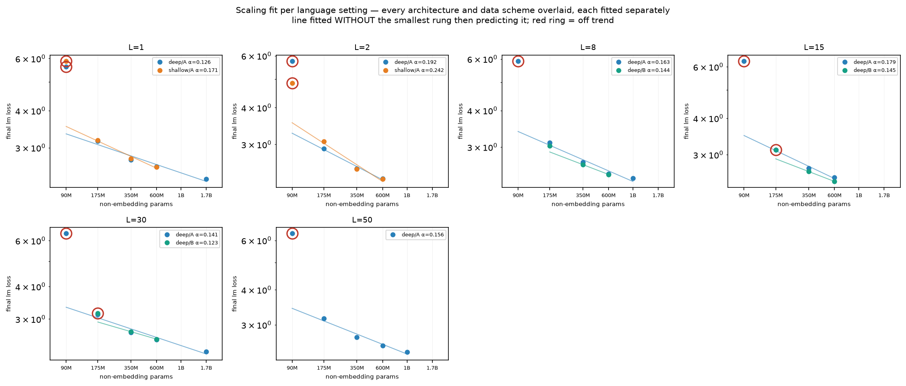
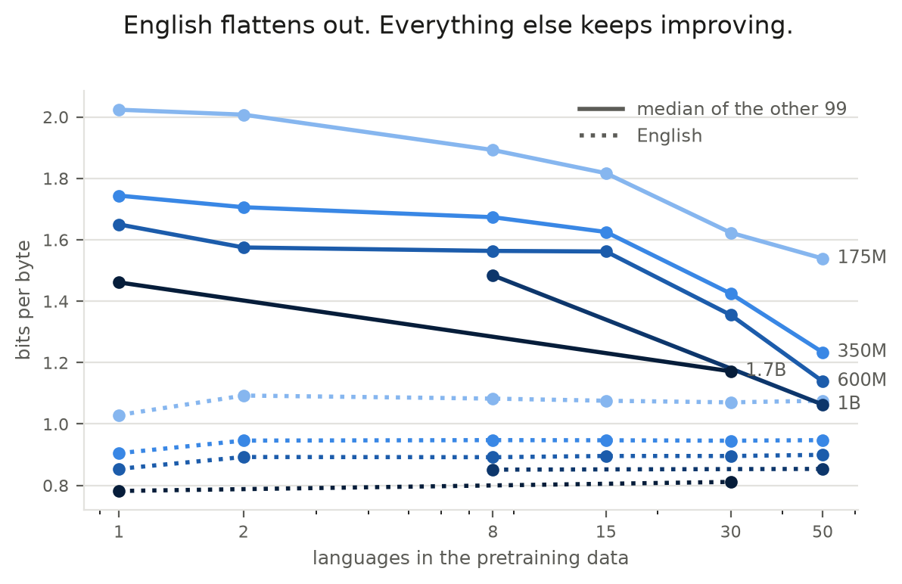
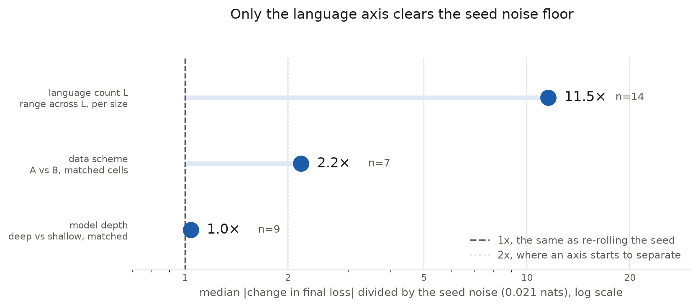

# Signal-Aware Multilingual Evaluation on a Small-to-Large Predictivity Ladder

**María Grandury** — École Polytechnique Fédérale de Lausanne (EPFL) · Research report, 14 September 2026 · branch `feat/snr-update`

## Abstract

Training multilingual language models requires repeated design decisions — data mixtures, architectures, tokenizers — that are made on small proxy models and evaluated on benchmark suites whose reliability degrades outside English. We extend the Signal-and-Noise framework of Heineman et al. (2025) to a controlled multilingual ladder: six model sizes (90M–1.7B non-embedding parameters), seven language settings (1 to 100 languages at a fixed 50 % English share), two intervention axes (model depth and language-set scheme) and seed replicates, each rung trained to five times its Chinchilla-optimal budget and scored on per-language bits-per-byte (BPB) on a fixed validation set and on the harness benchmarks of the `auto` group (15 benchmark families, 466 scored tasks across the project's languages, each cell scored on the tasks in the languages it trains on). This report records the analysis pipeline built for that ladder and the findings it produces on the 66 cells finished so far. Four results stand out. Adding languages costs English one increment at the first extra language and nothing after, while the non-English median falls throughout. Three quarters of the multilingual benchmark suite sits at chance at these sizes, and what survives the gate is one family: 62 of the 68 languages that have any measurable SNR at 1B keep a benchmark, and in 55 of them the highest-SNR one is MultiBLiMP, a minimal-pair grammaticality test rather than a knowledge or reasoning task. The framework's own noise definition — the spread over a run's last checkpoints — understates the seed-to-seed noise by a factor of two here, which moves every SNR. And on the question the ladder was built for, the benchmark suite reads a data-scheme decision as a coin flip: a 175M proxy picks the same scheme as the 600M reference on 50 % of 2,896 benchmark tasks at 15 languages and 57 % at 30, and a 350M proxy on 55 % and 48 %, while per-language bits-per-byte at 350M agrees on 83 % and 100 % of the languages both schemes train. No intervention comparison yet resolves against 1B, so these are small-to-600M results, not small-to-large ones. The analysis reads one published artefact, the per-checkpoint ladder report, so every number regenerates from the same file.

## 1. Introduction

Pretraining a multilingual model is a sequence of decisions taken on proxies: a smaller model, an earlier checkpoint, a cheaper benchmark. Each proxy is only useful if it ranks the alternatives the way the model that ships would. Heineman et al. (2025) showed, on the English DataDecide ladder, that a benchmark's *signal-to-noise ratio* — the dispersion of scores across model variants against the variability of a single run's late checkpoints — predicts both *decision accuracy* (the agreement between the small-model and the large-model ranking) and *scaling-law error*. Our earlier work (Grandury, 2026) carried the framework to a 36-model multilingual sweep over three data mixtures and 12 languages and found that the dispersion family of SNR definitions transfers across seeds, that the above-random gate removes most translated knowledge benchmarks at sub-1B scale, and that language and subject subsets can beat full benchmarks.

That sweep left the question the multilingual practitioner actually asks unanswered: **at a given number of languages, which model sizes can stand in for the large one when a design choice must be ranked, and how does the answer move as languages are added?** The predictivity ladder (Section 4) was built for that question. This report documents:

1. the pipeline that turns the ladder's published per-checkpoint table into the seven analyses of Section 5, with the logical fixes that surfaced while adapting it (Section 5.8);
2. the findings that are already established on the trained rungs (Section 6);
3. the threats to validity the design carries (Section 7) and the plan to the paper (Sections 8–9).

**Research questions.** RQ1 Which multilingual benchmarks produce model rankings at small scale that hold at larger scale? RQ2 Can a benchmark metric computed at small scale (an SNR) predict that decision accuracy, removing the need to evaluate the large model? RQ3 Which benchmark design choices lead to higher reliability? RQ4 — new — which proxy sizes rank an intervention like the reference at each language count, and does per-language BPB agree with the benchmarks about it?

## 2. Related work

**Benchmark reliability.** Heineman et al. (2025) define signal as the relative dispersion of scores across models and noise as their variability across late checkpoints, and show that high-SNR benchmarks better preserve rankings and reduce scaling-law error; they validate checkpoint noise against seed re-runs on DataDecide (Magnusson et al., 2025), the 25-recipe × 4-size ladder we compare against in RQ3. Madaan et al. (2024) quantify evaluation variance from seeds and prompts; Polo et al. (2024) and item-response approaches show that small informative subsets can replace full benchmarks — the subset question of our RQ4. Schaeffer et al. (2024) explain why downstream capabilities are hard to predict from scale: emergent, multiple-choice metrics degrade the monotone signal that per-token losses carry, which is why the ladder's outcome metric is BPB and the benchmarks are the secondary signal.

**Scaling ladders.** The OLMo compute-efficient ladder (Bhagia et al., 2024) fixes non-embedding sizes and trains each rung at a multiple of the Chinchilla-optimal budget (Hoffmann et al., 2022), then predicts task scores through a two-step fit; the ladder here follows its size convention and its 5×C budget. Hägele et al. (2024) show that warmup-stable-decay schedules give properly annealed endpoints at several budgets from one run, which is how we propose to test whether 5×C is the right budget at high language counts (Section 8). Choshen et al. (2024) catalogue the ways scaling-law fits go wrong with few points — our per-language fits use four to five rungs and are read as prediction error, not as laws.

**Multilingual scaling.** The "curse of multilinguality" (Conneau et al., 2020) and its later quantification (Chang et al., 2024) describe the per-language cost of adding languages at fixed capacity; ATLAS-style multilingual scaling laws put the compute-optimal tokens-per-parameter ratio well above 20 as the language count grows, which motivates both the fixed 50 % English share and the open budget question. Benchmark coverage across the ladder's 100 languages comes from Belebele (Bandarkar et al., 2024), Global-MMLU (Singh et al., 2025), INCLUDE (Romanou et al., 2025), Global PIQA (Chang et al., 2025), MultiBLiMP (Jumelet et al., 2026), IrokoBench (Adelani et al., 2025) and the classic XNLI / XStoryCloze / XCOPA / XWinograd / PAWS-X families; their provenance (human vs machine translation, native authoring, template generation) is the design axis of RQ5.

## 3. The framework

For a benchmark *b* and a model size *s*, let *mj* be the final score of design variant *j* and *ct* the score of the reference run at late checkpoint *t*.

- **Signal** = maxj,k |mj − mk| / m̄ — the relative dispersion across variants (the "mean pairwise distance" and 20 other variants in `snr/snr_variants.py` replace the max by other spread statistics).
- **Noise** = σt(ct) / c̄ over the last *N* = 5 checkpoints; on the ladder also the sample std over seed replicates where the ×3 cells exist.
- **SNR** = Signal / Noise.
- **Decision accuracy** = the fraction of variant pairs ordered the same way at the proxy and at the reference (`decision_acc_fast`); **DA-size** compares sizes at their final checkpoints, **DA-ckpt** an early checkpoint (20/40/60/80 % of the run) to the final one within a size.
- **Scaling-law error** = the relative error of the reference's per-language BPB predicted by a power law log BPB = a − α log N fitted on the proxy rungs.
- **Above-random gate**: a (benchmark, size) cell enters SNR only if its mean score beats 1/noptions by 0.05; it depends on raw scores and the option counts only.

The ladder adds one construct: **intervention decision accuracy** over a population of items. With two levels of an intervention (deep vs shallow; scheme A vs B) the pairwise definition reduces to sign agreement of the level difference between proxy and reference, and the population is the set of per-language BPB values (or benchmark tasks) the two levels share.

## 4. Experimental design

Figure 1. The predictivity ladder: language settings (rows) × non-embedding sizes (columns); each cell lists scheme, architecture and seeds. 62 runs at one intervention level, 162 with both architectures and scheme B where its language set differs.

| | 90M | 175M | 350M | 600M | 1B | 1.7B |
|---|---|---|---|---|---|---|
| Layers × dmodel (deep) | 15 × 768 | 16 × 1024 | 20 × 1280 | 24 × 1536 | 28 × 1792 | 30 × 2304 |
| Layers × dmodel (shallow) | 8 × 1024 | 10 × 1280 | 14 × 1536 | 14 × 2048 | 17 × 2304 | 20 × 2816 |
| Tokens (D = 100·N) | 9.3B | 17.6B | 34.4B | 59.5B | 94.4B | 167.2B |
| Checkpoints saved / evaluated | 20 / 10 | 20 / 10 | 20 / 10 | 20 / 10 | 40 / 20 | 60 / 30 |
| Language settings | all 7 | all 7 | all 7 | all 7 | all 7 | 1, 2, 8, 30, 100 |
| Seeds | 1 | 3 at L ∈ {1, 2, 50, 100} | 1 | 3 at L ∈ {1, 2, 50, 100} | 3 at L ∈ {1, 2, 30} | 1 |

**Models.** Sizes are non-embedding parameters (Bhagia et al., 2024); the 131k Apertus vocabulary would otherwise dominate the small rungs. Deep and shallow ladders share layer structure (head dim 64, FFN ×4, GQA 4) and differ only in aspect ratio (width/depth ≈ 64 vs ≈ 128) at equal N (±5 %). AdEMAMix, WSD schedule (4 % warmup, 20 % decay), peak learning rate from the 6ND law at each run's own budget, width-scaled init, GBS 504 × 4096 tokens.

**Data.** English from DCLM-edu, the other languages from FineWeb-2-HQ; every multilingual setting is 50 % English, the rest allocated at temperature T = 1 across the setting's languages. Scheme A takes the top-(L−1) FineWeb-2 subsets by bytes (the L100 list swaps eight benchmark-less subsets for the next ones with ≥ 2 benchmark families); scheme B replaces the small settings with script- and family-diverse picks, so the two schemes differ only at L ∈ {8, 15, 30}. Lists are nested across settings.

**Outcome metrics.** Per-language BPB on a fixed validation set (5M tokens per language, carved out of the first file of every subset and excluded from training) scored on every saved checkpoint; the `auto` benchmark group of the swiss-ai `lm-evaluation-harness` fork intersected with each cell's trained languages (15 tasks at L1, 463 at L100), evaluated on every second saved checkpoint and the final one. Every checkpoint is converted to Hugging Face format; the ladder's compute axis is 6 × (Nnon-emb + d·V) × D.

**Source of truth.** `src/pretrain/ladder_report.py` builds one wide table — one row per checkpoint, one column per measurement — from the training logs, the harness results and the BPB files, and publishes it to the Hugging Face dataset `msnr-data/ladder-report`. The analysis package loads that file (downloading it on first use), melts it into a long (model, checkpoint, task) frame in which per-language BPB is a task like any benchmark, drops diverged and unfinished runs, and restricts checkpoints to the grid every size shares so that the late-window noise spans the same fraction of training at every rung.

## 5. Analyses

Each research question is one directory under `src/signal-and-noise/analysis/`, read results-first; `run_all_predictivity.sh` runs them in dependency order and rewrites the results blocks of every README. The status column says what exists today.

| RQ | question | method | inputs | status |
|---|---|---|---|---|
| RQ0 | How do scores move with compute across language settings and sizes; which benchmarks clear chance? | score vs FLOPs curves per language setting and size; the above-random gate from `n_options` | ladder report | run; 113 of 461 gated tasks clear chance |
| RQ1 | Does a benchmark rank the design variants at a small size / early checkpoint like the reference? | DA-size for every bucket pair (90M→175M … 1B→1.7B); DA-ckpt at 20/40/60/80 % | ladder report | run; 5,124 DA cells over 96 languages × 12 benchmarks |
| RQ2 | Which of 22 SNR definitions predicts DA, per language; does it survive a seed swap? | per-language Pearson r of log SNR vs DA; seed holdout on the ×3 cells; variant families | rq01 tables | run; best variant `discrepancy`, r = +0.06 (DA-size), and `dist_std` at +0.20 on DA-ckpt; no per-language choice transfers across seeds |
| RQ3 | Does our SNR agree with AllenAI DataDecide on the shared English tasks? | Pearson r / Spearman ρ over the shared tasks at matched sizes (90M↔90M … 1B↔1B) | rq02 + DataDecide | not run — the DataDecide table is a git-lfs pointer in this clone |
| RQ4 | Can a language or subject subset beat the full benchmark's SNR? | cumulative subset sweep ordered by standalone SNR, random-order baseline; now over 100-language families and the BPB family | ladder report | run; median subset gain 0.98 SNR on Global-MMLU subjects |
| RQ5 | Which design features predict SNR? | Kruskal–Wallis over curation, format, option count, passage; 17 families with provenance | rq02 tables | run; no design feature individually significant among the survivors |
| RQ6 | Which proxy sizes rank an intervention like the reference at each L? | intervention DA over per-language BPB / benchmarks; per-language BPB scaling-law error; effect vs seed and checkpoint noise | ladder report | run; 505 scaling fits (202 predict 1B, 202 predict 1.7B), 36 DA cells all against 600M |

### 5.1 RQ0 — curves and the above-random gate

Score-vs-FLOPs curves per benchmark family, one line per language setting and size, with the per-setting "signal" bracket at the target size; and the gate: a (benchmark, size) cell is above random iff its mean final score beats chance by 0.05, where chance comes from the option counts derived from the evaluated samples (`configs/tasks.json`) with a per-family fallback. Per-language BPB and generative tasks have no chance level and are never gated. Every downstream SNR cell that fails the gate is set to NaN, so the gate propagates to all RQs and never depends on any of them.

### 5.2 RQ1 — decision accuracy

The truth the rest is scored against. Models are the ladder's cells; the cross-size identity is the cell's design variant (language setting, scheme, architecture, seed), so a variant trained at two sizes is one pair. DA-size compares final checkpoints between every bucket pair with ≥ 2 shared variants; DA-ckpt compares the checkpoint nearest 20/40/60/80 % of a run to its final one. Multilingual tasks are evaluated only on cells that train the language, so each task's population is the variants that exist at both sizes *and* were evaluated on it; `n` is reported with every value.

### 5.3 RQ2 — the SNR definition

Twenty-two variants of the SNR (dispersion, relative-spread, discrepancy, robust and depth families) computed per (task, size) from the variants' final scores and the late-checkpoint noise, correlated per language with DA-size and DA-ckpt as Pearson r of log10 SNR. The seed holdout trains the variant ranking on seeds 64/313 of the ×3 cells and tests it on seed 1904 of the same cells; only a ranking that survives the swap is reported as a recommendation, and at the family level, since the 36-sweep showed the exact argmax never transfers.

### 5.4 RQ3 — agreement with DataDecide

Cross-corpus Pearson r and Spearman ρ of log SNR over the English tasks both corpora evaluate, at matched sizes; on the ladder the shared universe is `arc_easy`, `arc_challenge`, `hellaswag` and MMLU (through the Global-MMLU English split), so the read is indicative. DataDecide's "signal" is a dispersion over 25 data recipes; ours is over language settings and schemes, a narrower axis — a low correlation says the populations differ before it says the definition does.

### 5.5 RQ4 — subsets

For each multilingual family the per-language tasks are ranked by standalone SNR and cumulative subsets swept; the best subset and its gain over the full set are recorded per size, with a random-order baseline. On the ladder the families span up to 100 languages, and the per-language BPB family is swept the same way: which languages' BPB make the sharpest macro-average.

### 5.6 RQ5 — benchmark design

Per-family SNR (median over its per-language tasks) grouped by curation method, source origin, task format, option count and a reading-passage flag, tested with a family-level Kruskal–Wallis; seventeen families with provenance, including the natively-sourced INCLUDE and Global PIQA and the human-translated IrokoBench families the ladder adds.

### 5.7 RQ6 — proxy predictivity (new)

Three reads over the (proxy size, L) grid. (i) *Intervention DA*: for each L, the reference is the largest size trained there; for each smaller size, DA is the fraction of population items — per-language BPB on the languages both levels train, all 100 validation languages, the benchmark tasks, or the single macro-BPB decision — on which the proxy agrees with the reference about which level is better. (ii) *Scaling-law error*: per language, log BPB = a − α log N fitted on the proxy rungs up to a ladder top predicts the reference's BPB; the relative error per ladder top says how far up the ladder one must train before the reference is predicted within a given tolerance. (iii) *Effect vs noise*: every decision's |Δ| against the seed noise (sample std over replicates) and the late-checkpoint noise (raw and detrended, because under WSD the final window is still descending); a decision inside the noise is a coin flip whatever its DA — the plan's own caveat, and the per-task version of the "read this against the seed row" rule of the ladder report.

### 5.8 What changed in the code

The 36-sweep pipeline read a per-(model, checkpoint, task) parquet built from the cluster's eval logs; the ladder pipeline reads the ladder report. The adaptation kept every analysis script and changed the inputs: a loader for the wide table, pool definitions whose member filters apply to the ladder's axes, task metadata from `configs/tasks.json` (116 languages instead of a 12-entry map), the gate keyed on option counts with a fallback, and reference sizes that fall back to the largest rung with data while the big rungs train. Logical fixes found on the way: the analysis configuration had lost the checkpoint-DA fractions and the size buckets (the package failed at import); the documented FLOPs convention was not implemented; the ladder report mislabelled trained languages (an iso3-prefix comparison against iso2 codes) and read the BPB files unguarded; the models registry lacked the scheme-B cells and the 1B row's adopted seeds; and the auto-eval watchers' due rule (`iter % (2 × interval)`) could never mark the 1B cells trained on the older 2,287-iteration grid as due, so those cells would never have been evaluated. Two more surfaced when the evaluation branch was merged in: the source registry's `loader` key was dropped in the merge, which routed every ladder pool to the 36-sweep parquet and reported the wrong models under the ladder's name instead of failing, now fixed at the root by deriving the loader from the split; and `cell_fineweb_subsets` was inlined away on the other side while the RQ6 script still imported it. Details are in the branch's commit messages.

## 6. Findings

Every number in this section comes from one artefact: the wide per-checkpoint table `ladder_report.csv`, published to `msnr-data/ladder-report` and read here from the repository branch `data/ladder-report` (byte-identical to the Hub copy), run through `run_all_predictivity.sh` on 14 September 2026. Nothing is quoted from a cluster snapshot.

**What the ladder contains today.** The report holds 106 cells, of which **66 are complete**; after the loader drops diverged runs, **57 models** enter the analysis and 54 of those are also on their own scaling trend. The canonical seed-1904 pool is 41 models, the all-seeds pool 53. Language settings run to L = 50 — **L = 100 has no finished cell at any size** — and the top rungs are thin but no longer empty: 1B is finished at L ∈ {8, 50} and **1.7B at L ∈ {1, 30}**, all deep, scheme A, seed 1904. Seed replicates exist at 175M and 600M for L ∈ {1, 2, 50}: six ×3 cells, which carry the entire noise estimate. Three further data schemes now appear in the report — AT3 (the same language lists at sampling temperature 3), ES and ZH (L2 with Spanish or Chinese in place of Russian) — and they are held out of the headline pool, in the separate `predictivity_schemes` pool, because they are a different intervention and would widen every signal if mixed in. This shape governs how far every result below can be pushed.

Figure 2. Final training loss vs non-embedding parameters per language setting, architectures and schemes overlaid and fitted separately on the larger rungs, then asked to predict the smallest; red rings mark rungs off the fit.

**The 90M rung is not on the ladder.** Nine of ten 90M runs reach their best loss at 15–19 % of training and degrade to +1.2…+1.9 nats above it; held-out BPB rises with training (English 1.68 → 1.95, Russian 1.17 → 1.45 between 10 % and 100 % of the run). The cause is an optimizer timescale fixed in steps (AdEMAMix β3, 10,000 steps) on runs whose length spans 18× across the ladder: the 90M run is shorter than the optimizer's memory. A control with β3 tied to the run length removes the divergence (final loss 5.762 → 2.778 at 90M-L2) and beats the *uncorrected* 175M, which suggests the 175M rung is depressed too. The decision is not to retrain: the loader drops diverged runs and the ladder is reported with and without the rung. One cell escapes that filter — `90M-L2-shallow` ends 0.234 nats above its best, 0.016 under the 0.25-nat threshold — so it is the only 90M model that reaches the pools while sitting +1.29 nats off its own fit. It anchors 101 of RQ6's 505 scaling fits — the shallow scheme-A L2 chain, the only one whose ladder starts below 175M. `run__off_trend` is published in the report and the loader does not read it; gating on it is the one-line change that removes this.

**Above 90M, scaling behaves, and the exponent barely moves with L.** Final loss falls monotonically with size at every language setting; the fitted exponent is α = 0.13–0.19 across L for deep/scheme A, and the residuals of the healthy rungs stay within ±0.10 nats. The top rungs stay on the line where they exist: at L8 the chain is 3.102 → 2.659 → 2.432 → 2.346 (1B) with residual +0.06, at L50 3.156 → 2.708 → 2.532 → 2.402 (1B) with +0.04, and the two new 1.7B cells land at +0.04 as well (L1 3.161 → 2.731 → 2.591 → 2.349, L30 3.129 → 2.666 → 2.498 → 2.249). That the exponent is nearly independent of the language count is itself a result: adding languages moves the intercept, not the slope.

Figure 3. Held-out bits-per-byte at the final checkpoint, deep / scheme A / seed 1904. English pays a one-time cost at the first extra language and nothing after; the non-English median falls throughout.

**The multilingual tax is paid once.** English BPB at 600M goes 0.854 (L1) → 0.892 (L2) → 0.899 (L50): **+0.038 bits/byte for the first extra language, +0.007 for the next 48**. The non-English median falls throughout — 1.650 → 1.139 at 600M, 2.024 → 1.539 at 175M, and 1.484 → 1.063 between L8 and L50 at 1B. Comparing L50 against L2 language by language, L50 wins on 89, 81 and 78 of the 99 non-English languages at 175M, 350M and 600M, with median gains of +0.44, +0.34 and +0.35 bits/byte, against a macro-BPB seed noise of 0.011.

**Three quarters of the benchmark suite is at chance.** Of the 568 tasks in the report, 461 have a chance level; **113 of those clear it by the +0.05 margin at any size**. The effect is dominated by the answer count: 80 of 191 two-option tasks clear chance (42 %), 12 of 18 three-option ones (67 %), and **21 of 252 four-option** ones (8 %). Four families never clear chance at any size or language — `global_mmlu_full`, `global_piqa_parallel_cloze`, `global_piqa_nonparallel_cloze` and `truthfulqa-multi_mc1`. The gate opens steadily with size: 3 tasks clear it at 90M, then 62, 71, 85, 103 and **110 at 1.7B**. At 1B the survivors are `multiblimp` (57 tasks), `hellaswag` (15), `xnli` (9), `xwinograd` (6), `xcopa` (6), `xstorycloze` (5), `arc` (2), `paws` (2) and `include_base_44` (1); the 1.7B rung adds three more `xnli`, two more `paws`, one more `hellaswag` and the first `belebele` task to clear chance anywhere. On the 36-model sweep the same four-option families cleared chance for external 270M–70B models (122 of 124), so this is a capability floor of the small rungs rather than a property of the benchmarks.

**What survives the gate is one benchmark family, and where it can be compared it beats bits per byte.** Ranking every above-random measurement per language by SNR (best variant `discrepancy`, at 1B), **62 of the 68 languages with a measurable SNR at 1B keep at least one benchmark**, and in **55 of them the rank-1 benchmark is `multiblimp`**. This is the reverse of the picture the thinner ladder gave, and the extra eval coverage is what changed it.

The head-to-head is narrower than the coverage, because a language needs a bits-per-byte SNR too, and that exists only where the language is trained in at least two of the settings finished at 1B: 14 languages. The benchmark wins **11 of those 14** — `multiblimp_fra` 164 against 13.6, `multiblimp_spa` 123 against 13.6, `multiblimp_rus` 117 against 7.8, `multiblimp_eng` 104 against 27.9, `multiblimp_deu` 59 against 16.7, `multiblimp_ita` 52 against 19.4, and five more between 13 and 22 — while Bengali, Marathi and Japanese go the other way.

Two cautions travel with this. MultiBLiMP is a minimal-pair grammaticality test, so a high SNR there says the models are separable on morphosyntax, not on the knowledge or reasoning the rest of the suite tries to measure. And the languages that support the comparison are still the high-resource ones: outside them the suite offers `multiblimp` or nothing.

**SNR barely predicts decision accuracy here.** The best of the 22 variants on the canonical pool is `discrepancy`, and it reaches a mean Pearson r of log₁₀(SNR) against decision accuracy of only **+0.06** (size DA), −0.05 (checkpoint DA) and 0.00 overall, against R = 0.791 reported by Heineman et al. (2025) on the English DataDecide ladder. Checkpoint DA has a different leader, `dist_std` at +0.20, with `mad` and `rel_mpsd` beside it, so no single variant is best on both kinds of decision. The wider eval coverage did not rescue the correlation, it weakened it: on the thinner ladder the leader reached +0.32 on checkpoint DA, and adding tasks and rungs pulled that down to +0.20 for the best and 0.00 for the overall winner. With 41 models in the canonical pool, two-level interventions and coarse DA, we cannot yet separate "the framework transfers weakly to multilingual ladders" from "this pool is too small to measure it". The honest reading today is that on this ladder an SNR does not tell you which benchmark will rank a design decision correctly.

**Nothing about the variant choice transfers across a seed swap.** Training the variant choice on seeds 64/313 and testing on seed 1904: Spearman ρ of the global ranking is **+0.01** under checkpoint DA and **−0.20** under size DA. Pearson r between splits is −0.06 (n = 1,104 cells) under checkpoint DA and +0.27 (n = 22) under size DA. Per-language agreement stays at the floor: 11 % at family level under checkpoint DA, 1 % under size DA, over 122 language cells. Retention of the train-picked variant reads 100 % under size DA, but on a single cell, so it carries no weight. Successive runs of this holdout have given ρ = +0.70, +0.29 and now +0.01 on checkpoint DA, which is itself the result: the estimate is dominated by noise. The stable conclusion is the negative one: a per-language argmax over SNR variants does not survive a seed change, so a variant *family* is the finest recommendation the data supports.

**The standard noise definition is about 2× too optimistic.** Signal-and-Noise measures noise as the spread over a run's last few checkpoints. On the ×3 cells we can measure it the other way, over seed replicates of the same cell, and the median ratio of seed noise to detrended late-checkpoint noise is **2.04** over 5,546 (size, L, task) cells. An SNR computed the standard way is therefore optimistic by roughly a factor of two here, and an effect that looks like 2× checkpoint noise is about the size of a single seed re-roll.

Figure 4. Median |Δ final loss| for each axis, in units of the seed standard deviation (0.021 nats) measured on the six ×3 cells. Matched pairs only, healthy cells only.

**Only the language axis clears the noise floor on the aggregate metric.** Against a seed standard deviation of 0.021 nats on final loss, measured on the six ×3 cells: the across-L range at fixed size is **11.5×** the seed noise (14 cells), the scheme A/B difference is **2.2×** (7 matched pairs), and the deep/shallow difference is **1.0×** (9 matched pairs) — the same model measured twice. Resolved per individual task rather than on the aggregate, the depth effect is larger (median 1.43× the seed noise, 35 % of 853 cells above 2×), so depth separates somewhere; it does not separate on the metric the ladder is built around. Depth is half the grid.

**The predictivity question is answerable for bits per byte and still negative for benchmarks.** RQ6 now produces 36 intervention-DA cells and 505 scaling fits. The scaling fits reach the top of the ladder — 202 predict a 1B reference and 202 a 1.7B one — but **every one of the 36 intervention comparisons still resolves against 600M**: the finished 1B and 1.7B cells are all deep, scheme A, so none of them has a matched shallow or scheme-B counterpart to compare against. What the BPB cells show is a clean size threshold on the scheme decision: over the languages both schemes train, 350M agrees with the reference at L8/L15/L30 (1.00 / 0.83 / 1.00) while 175M gets it backwards at the larger settings (1.00 / 0.00 / 0.04).

The benchmark population is now scored at both proxy rungs, and it is a coin flip at each of them. Against the 600M reference over 2,896 shared benchmark tasks per setting, a 175M proxy agrees on **45.6 % at L8, 50.5 % at L15 and 56.7 % at L30**, and a 350M proxy on **45.3 %, 55.5 % and 48.0 %**. Going from 175M to 350M does not help, and at L30 it makes the answer worse. Per-language BPB behaves completely differently over the same interventions: wrong at 175M (0.00 at L15, 0.04 at L30) and then right at 350M (0.83 and 1.00). So the two measurements do not merely differ in accuracy, they differ in whether a bigger proxy buys anything at all.

The smallest-predictive-size test asks for more: a proxy that agrees *and keeps agreeing at every larger size*. Here the gap narrows but does not close. Of **8,449 benchmark task comparisons**, **3,995 (47 %)** pass; of 500 per-language BPB comparisons, **365 (73 %)** do. On the earlier, thinner ladder no benchmark comparison passed at all, so this is the single largest movement in the report and it moves in the benchmarks' favour. It should still be read against the coin-flip result above: a task can survive this test by agreeing at both rungs by chance, and 47 % is close to what two coin flips would give. The measurements also still disagree about the answer itself, BPB preferring scheme B at L15 and L30 where the benchmark suite prefers scheme A at L30. The encouraging half is unchanged — per-language BPB at the reference is predicted from the proxy rungs to within 4–8 % (median |relative error| 0.076 predicting 1.7B at L1, 0.051 predicting 1B at L8, 0.058 predicting 1.7B at L30, 0.043 predicting 1B at L50), with L2 the one outlier at 0.244 against a 600M reference.

**Subsets help where the full benchmark is weakest.** A subject or language subset beats the full set by a median 1.09 SNR on Global-MMLU subjects, 0.80 on its per-language split and 0.51 across benchmarks generally; the largest single gains are `global_mmlu_full_ja` at 175M (1.15 → 3.17), `global_piqa_parallel_cloze` at 175M (1.08 → 3.15) and `xnli` at 1.7B (0.06 → 1.99). These are gains on benchmarks that mostly sit at or near chance, so they should be read as "the full set is nearly signal-free" rather than "the subset is good". Among the nine families that clear the gate, no design feature is individually significant — option count H = 0.02, p = 0.88; task format H = 1.12, p = 0.57; curation H = 5.12, p = 0.08. Once the gate has fixed the answer space, how a benchmark was built does not predict its reliability.

### 6.1 Seven questions about the instruments themselves

Asked after the 14 September run and answered on the same artefact. Figures are in `documents/public/ladder/rq_*.png`, produced by `documents/figures/fig_rqs.py`.

**Which benchmarks scale predictably?** Fitting each task's score against log parameters from 175M to 1B, the completion families are near-perfectly ordered: median R² of 0.97 for `lambada_openai_mt`, 0.96 for `xwinograd` and for per-language BPB, 0.93 for `xstorycloze`, 0.89 for `hellaswag`. At the other end `global_mmlu_full` reaches 0.08, `include_base_44` 0.15 and `belebele` 0.31, so their scores are close to unrelated to size. `truthfulqa-multi_mc1` is the strange case: a tight fit (R² 0.86) with Spearman ρ = −0.8, meaning it reliably gets *worse* as models grow. BPB and loss also carry ρ ≈ −1, but for them that is the correct sign.

**Which benchmarks are stable?** Taking relative noise over a run's late checkpoints at 1B, training loss (0.009), `xstorycloze` (0.010), `multiblimp` (0.011) and per-language BPB (0.014) are the steadiest measurements on the ladder; `include_base_44` at 0.206 is twenty times noisier than any of them. This compounds the previous answer: the families that do not move with size also do not sit still.

**Which languages benefit most from scale?** On the 50-language mixture, going 175M → 1B, **all 100 validation languages improve**, median 0.391 bits/byte. The three patterns the team named all appear, but relative to the median rather than an absolute floor, because nothing regresses. The ordering is the result: Spearman ρ = **+0.63** between where a language starts and what it gains, so scale helps most where the model is currently worst. That is the opposite of a rich-get-richer pattern and it is the argument for pushing the ladder higher rather than widening it first.

**Does the benchmark separate what we want to compare?** Signal ÷ noise at 1B: per-language BPB **7.1×**, `hellaswag` **5.1×**, `multiblimp` **2.3×**, `arc` 1.6×, `lambada_openai_mt` 1.4×, training loss 1.3×, and then every remaining family is **below 1×** — `paws` 0.8, `xnli` 0.6, `xcopa` 0.5, `xstorycloze` 0.5, `include_base_44` 0.4, `xwinograd` 0.4. Below 1× the benchmark varies more between checkpoints of one model than between the models we are trying to tell apart. This is the clearest improvement in the whole refresh: `hellaswag` (15 tasks) and `multiblimp` (57 tasks) have crossed the line and are well powered, so BPB is no longer the only usable measurement.

**How early can we predict final performance?** Comparing an early checkpoint's ranking with the same run's final ranking at 1B, per-language BPB is at **0.91 by 20 % of the run** and stays flat to 80 %. `hellaswag` (0.90) and `arc` (0.88) are almost as early, `multiblimp` reaches 0.81 and climbs to 0.91, and the at-chance families crawl up from 0.41. Averaged over everything the suite goes 0.70 → 0.71 → 0.74 → 0.84 across the four fractions. On BPB, four fifths of each run adds nothing to the ranking, so the milestone-eval rule could be pulled much earlier.

**What is the smallest suite that predicts full model quality?** Adding benchmark tasks best-first, judged by agreement with the ranking that per-language BPB gives, **four tasks reach ρ = 0.98** while the whole suite of 2,897 usable tasks reaches **0.53**, and a single task already gets within 5 % of the peak. 2,893 of the 2,897 suite sizes beat the whole suite. The tail is at-chance tasks whose scores are noise, and averaging them in actively destroys the signal. A small curated suite is not a compromise here, it is strictly better than running everything.

**Which is the most informative surrogate?** Counting a surrogate as working when some proxy size picks the reference's winner and every larger size keeps picking it: per-language BPB **73 % of 500** comparisons (175M alone suffices for 32 % of them), macro BPB 60 % of 5, training loss 80 % of 5, benchmarks **47 % of 8,449** (175M alone 23 %). Only the first and last rows are well powered; the two aggregate metrics rest on five comparisons each and should not be ranked against the others on this evidence. The benchmark row was 0 % on the thinner ladder, so the suite has gone from useless to unreliable rather than from useless to usable.

## 7. Threats to validity

- **Noise window under WSD.** The late-checkpoint noise is measured over the last five saved checkpoints, i.e. the final 25 % of a 20-checkpoint run, inside the decay phase where the loss is still falling; the raw std therefore contains trend. RQ6 reports a detrended std and, on the ×3 cells, the seed std; the shared checkpoint grid keeps the window the same fraction of training at every size (the 1B row is read on the k/20 subset).
- **Reference rungs.** RQ6's scaling-law fits reach the top of the ladder (202 of 505 predict a 1B reference and 202 a 1.7B one), but every one of its 36 intervention comparisons resolves against **600M**: the finished 1B cells are L ∈ {8, 50} and the finished 1.7B cells L ∈ {1, 30}, all deep and scheme A, so no cell above 600M yet has a matched shallow or scheme-B counterpart to compare against. Each RQ6 cell names its own `reference_size` so this stays visible, but no *decision* result is small-to-large yet — they are small-to-600M.
- **Sampling temperature.** At T = 1 the FineWeb-2 half of L100 gives 66 of 99 languages under 10M tokens at 90M and the smallest language 0.8M tokens even at 1B; a per-language SNR near zero there is a property of the mixture, not of the benchmark. The plan's recommendation is T = 2 sweep-wide (which repeats no data); until then per-language claims at L100 are restricted to languages above a token floor.
- **Coverage.** Every trained language has at least one benchmark family, but 16 have exactly one and for five of them it is a grammaticality probe (MultiBLiMP); INCLUDE v2 in multiple-choice form is the best single addition.
- **Few points per fit.** Per-language scaling fits use three to five rungs; they are reported as prediction error at a stated ladder top, never as scaling laws.
- **Quantised DA.** With two-level interventions and few variants per size, DA cells are coarse; the reported `n` and the effect-vs-noise ratio must be read with every value.

## 8. Plan

1. Finish the reference rungs before anything else: 1B at more language settings with matched shallow / scheme-B counterparts, or 1.7B — not both. Until one exists, RQ6 measures small-to-600M and the headline question stays open.
2. Decide T (2 vs 1 plus a token floor) and rebuild the L100 mixture; and fix the eval walltime at L ≥ 30, which is why L = 100 has no finished cell — an over-cap job writes nothing when it is killed, so it is resubmitted and killed indefinitely.
3. Test whether 5×C is the right budget at L ≥ 30 with 12 WSD cooldown branches (350M/600M × L ∈ {1, 30, 100} × f ∈ {0.25, 0.5}), after the cheap check that the multilingual loss bend is not driven by data-starved tail languages.
4. Wire INCLUDE v2 (multiple-choice form) and switch or drop LAMBADA-MT; derive option counts for the newly wired tasks.
5. Settle the 90M treatment and gate the loader on `run__off_trend`, so the one surviving off-trend 90M cell stops standing in for the whole rung.
6. Decide what the benchmark suite is for, given that BPB out-SNRs it in 89 of 96 languages: report BPB as the measurement and benchmarks as the gated exception, or treat the result as an artefact of the gate and build an SNR comparable across gated and ungated measurements.
7. Write the paper on the ≤ 600M ladder while 1B/1.7B serve as the extrapolation check.

## 9. Proposed new and improved research questions

- **Seed noise as the primary noise (RQ2).** Heineman et al. use checkpoint noise as a proxy for seed noise; the ×3 cells make the real thing measurable at two sizes and four language counts. Report the SNR-variant ranking under both noises and the ratio between them per family — if the ratio depends on the family (as WSD trend suggests), the checkpoint-noise shortcut is family-specific and the paper should say so.
- **Matched-compute decisions (RQ6).** Decision accuracy at equal FLOPs rather than equal fraction of training (the IsoFLOP slices at 1e19 / 3.2e19 / 1e20 carry three to four sizes each; the milestone-eval rule is decided but not implemented). The practitioner's question is "given this budget, which size and shape predict best", and the two axes can disagree.
- **Per-language BPB as the decision metric (RQ1/RQ6).** Compare the per-language decision (fraction of languages agreeing) with the macro-average decision; the plan notes they can disagree, and the ladder is the first place both are available per L.
- **Transfer to untrained languages (RQ6).** The validation set covers 100 languages for every cell, so the zero-shot BPB of untrained languages is free; ask whether a proxy predicts the reference's ranking on languages neither has seen, and how that changes with L.
- **Two-step scaling for benchmarks (RQ6).** Predict benchmark accuracy through BPB (a Bhagia-style loss-to-accuracy fit), which the ladder can fit across every checkpoint, instead of the direct log-N fit; compare the two error profiles per family.
- **Design features with power (RQ5).** The 36-sweep test was underpowered (nine surviving families); the ladder's 15 families and the external-model contrast give a within-format curation comparison (HellaSwag-MT vs XStoryCloze-human, both completion; ARC-MT vs Global-MMLU-full, both 4-option) that isolates curation from format.
- **Subset stability across seeds (RQ4).** Only subsets that recur across the seed holdout should be recommended; report the Jaccard overlap of the best subsets between the train and test seeds, as the 36-sweep did across sizes.

## References

- Adelani, D. I., et al. (2025). IrokoBench: A new benchmark for African languages in the age of large language models. *NAACL 2025*.
- Bandarkar, L., et al. (2024). The Belebele benchmark: a parallel reading comprehension dataset in 122 language variants. *ACL 2024*.
- Bhagia, A., et al. (2024). Establishing task scaling laws via compute-efficient model ladders. arXiv:2412.04403.
- Chang, T. A., et al. (2024). When is multilinguality a curse? Language modeling for 250 high- and low-resource languages. *EMNLP 2024*.
- Chang, T. A., et al. (2025). Global PIQA: evaluating physical commonsense reasoning across 100+ languages and cultures. arXiv:2510.24081.
- Choshen, L., Zhang, Y., & Andreas, J. (2024). A hitchhiker's guide to scaling law estimation. arXiv:2410.11840.
- Conneau, A., et al. (2020). Unsupervised cross-lingual representation learning at scale. *ACL 2020*.
- Grandury, M. (2026). Signal-aware framework for multilingual language model evaluation. Research proposal, Doctoral Symposium on NLP (SEPLN).
- Hägele, A., et al. (2024). Scaling laws and compute-optimal training beyond fixed training durations. *NeurIPS 2024*.
- Heineman, D., Hofmann, V., Magnusson, I., Gu, Y., Smith, N. A., Hajishirzi, H., Lo, K., & Dodge, J. (2025). Signal and noise: a framework for reducing uncertainty in language model evaluation. arXiv:2508.13144.
- Hoffmann, J., et al. (2022). Training compute-optimal large language models. *NeurIPS 2022*.
- Jumelet, J., et al. (2026). MultiBLiMP: a massively multilingual benchmark of linguistic minimal pairs. *TACL*.
- Madaan, L., et al. (2024). Quantifying variance in evaluation benchmarks. arXiv:2406.10229.
- Magnusson, I., et al. (2025). DataDecide: how to predict best pretraining data with small experiments. arXiv:2504.11393.
- Pagliardini, M., Ablin, P., & Grangier, D. (2024). The AdEMAMix optimizer: better, faster, older. arXiv:2409.03137.
- Polo, F. M., et al. (2024). tinyBenchmarks: evaluating LLMs with fewer examples. *ICML 2024*.
- Romanou, A., et al. (2025). INCLUDE: evaluating multilingual language understanding with regional knowledge. *ICLR 2025*.
- Schaeffer, R., et al. (2024). Why has predicting downstream capabilities of frontier AI models with scale remained elusive? arXiv:2406.04391.
- Singh, S., et al. (2025). Global MMLU: understanding and addressing cultural and linguistic biases in multilingual evaluation. *ACL 2025*.
