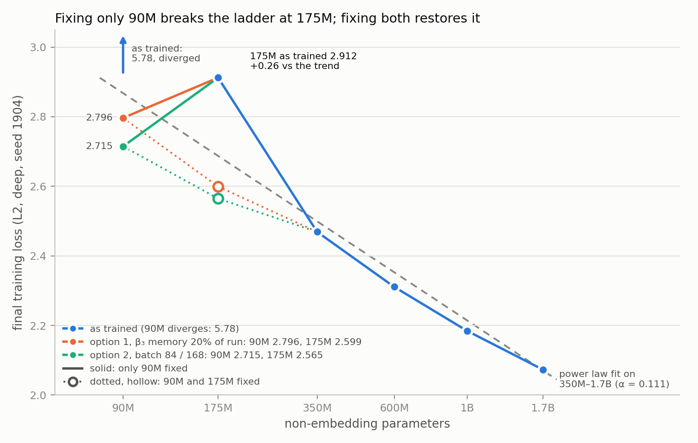

# The 90M rung does not sit on the scaling curve

<!-- ------------------------------------------------------------------ -->
<!-- APPENDIX DRAFT — self-contained, paper-ready. Everything below the  -->
<!-- "Working record" divider is the internal investigation log.         -->
<!-- ------------------------------------------------------------------ -->

## Appendix: the smallest rung of the ladder

Our predictivity study trains a ladder of models at six parameter counts,
each on its own compute-optimal-multiple budget, and asks how benchmark
rankings evolve with compute. A ladder of this kind is only as good as its
span: the bottom rung sets the left-hand anchor of every scaling fit, and a
displaced anchor tilts the fitted slope across the whole range. We therefore
examined the smallest rung, at 90M non-embedding parameters, before using it.

The 90M rung does not lie on the curve traced by the larger rungs, and the
reason is not that the models are too small. Nine of the ten completed 90M
runs *diverge*: each reaches its best training loss between 15% and 19% of
the way through training and then degrades monotonically for the remaining
four fifths, ending between 1.2 and 1.9 nats worse than its own best. No
larger rung shows this. The 175M runs take at most a single loss spike and
recover; the 350M and 600M runs reach their best loss after more than 90% of
training, as expected under a warmup-stable-decay schedule.

Two observations rule out the obvious explanations. First, this is not
overfitting: every run is single-epoch, so no example is seen twice. Second,
it is not a capacity floor. A capacity-limited model converges to a poor
loss and stays there; these models reach roughly 4.4 — against a value near
3.5 implied by extrapolating the larger rungs — and then get worse. Held-out
evidence confirms the degradation is real rather than an artefact of the
training objective: bits-per-byte measured on a disjoint validation set rises
with training on every language we checked (English 1.68 to 1.95, Russian
1.17 to 1.45 between 10% and 100% of training), and per-language perplexity
on the rarest languages diverges outright. The output distribution
deteriorates; it does not merely stop improving.

Nor is it the learning rate. Our peak learning rates come from a compute-based
scaling law evaluated at each run's own budget, which is hottest at the small
end. We trained the 90M rung at three learning rates spanning a factor of
nearly five, down to a value well below the law's prescription. All three
diverge, with the same signature, within the first quarter of training.

Nor is it the batch size. The ladder uses the same global batch at every rung,
so the smallest rung takes the largest batch relative to what its gradient
noise warrants — a mechanism that would single out the bottom rung. We
retrained the 90M rung at one half and one sixth of the batch, keeping the
number of optimizer steps fixed. Both diverge like the original, after 16–17%
of their steps against 21%, with the gradient norm above 1 on 90% of steps.
By the point of divergence the three runs have seen 1.92B, 0.81B and 0.25B
tokens, a 7.7-fold range: the failure follows optimizer steps, not tokens or
gradient noise. Because the three share a seed and a data order, this also
rules out a defect at some position in the data, which would strike at the
same token count.

The explanation consistent with all of the evidence is an interaction between
the optimizer's memory and the length of the run. We train with AdEMAMix,
which augments the usual momentum with a second, much slower exponential
moving average of past gradients, governed by a decay coefficient beta3. That
coefficient sets a timescale, of order 1/(1 - beta3) steps, over which the
slow average accumulates. We held beta3 fixed across the ladder — the natural
choice for keeping rungs comparable — at a value whose timescale is 10,000
optimizer steps. But the rungs differ enormously in length, because each
trains on a budget proportional to its own parameter count:

| rung | training steps | steps / optimizer timescale |
| ---- | -------------: | --------------------------: |
| 90M   |  4,500 | 0.45 |
| 175M  |  8,540 | 0.85 |
| 350M  | 16,660 | 1.7 |
| 600M  | 28,800 | 2.9 |
| 1B    | 45,740 | 4.6 |
| 1.7B  | 81,000 | 8.1 |

The 90M run is less than half the optimizer's own averaging window. It never
reaches the regime the optimizer was configured for; the slow average remains
dominated by gradients from early training, and is applied with a large
multiplier throughout. The ordering of this ratio matches the ordering of the
observed severity exactly: 90M diverges badly, 175M shows a single recovered
spike, and everything at 1.7 and above reaches its best loss at the end of
training. A fixed beta3 across a ladder
whose rungs differ 18-fold in length is thus not the neutral choice it appears
to be — it silently gives each rung a qualitatively different optimizer. It
also accounts for the batch-size result above: a timescale counted in steps
does not care how many tokens each step carries.

We tested this directly. In a control run at the 90M rung we set beta3 so
that the optimizer's timescale is a fixed fraction of the run (one fifth)
rather than a fixed number of steps, changing nothing else. The divergence
disappears completely:

| 90M, 2 languages | best loss | final loss | drift |
| ---------------- | --------: | ---------: | ----: |
| fixed timescale (10,000 steps) | 4.397 | 5.781 | +1.384 |
| timescale = 0.2 x run (900 steps) | 2.767 | **2.796** | **+0.030** |

The drift falls to that of a healthy rung, and the final loss improves by
2.99 nats — **1.60 nats better than the uncorrected run's own best**, so the
rung had been discarding not merely its last four fifths but most of the
value of the entire run.

We also checked the competing explanation, that our compute-based learning
rate law is simply too hot at the small end, by retraining the 175M rung at
roughly half its prescribed rate. That made it *worse* (2.912 to 3.023) and it
had not been diverging in the first place, so the law is not the cause and we
left it unchanged for the remaining rungs.

One consequence of the correction deserves care. The corrected 90M reaches a
lower loss (2.796) than the uncorrected 175M (2.912) despite training on half
as many tokens. A smaller model should not outperform a larger one on the same
data, and a control at 175M with the same correction confirms what that
implies: the 175M rung — at 0.85 of the optimizer timescale, the
second-shortest run — is also depressed, though it never visibly diverged.
Corrected, it finishes at 2.599 against 2.912, 0.31 nats lower, its single
loss spike gone, and the two corrected rungs fall back into the expected
order. The effect therefore reaches beyond the bottom rung. Whether it reaches
350M, at 1.7 timescales, is untested; until it is, the ladder's absolute
losses at 350M and below should be read as upper bounds on those
architectures' loss rather than as measurements of it.

**Treatment in the reported analysis.** *[Completed at revisit.]* Where the
90M rung is excluded, it is excluded as a rung whose optimizer configuration
is known to be mismatched to its run length — a documented and reproducible
training defect — and not as an unexplained outlier. We report the ladder both
with and without it so the effect on the fitted slope is visible. Correcting
it for the whole ladder would require retraining every rung, since the
correction changes the optimizer at all of them; that was outside the compute
budget of this study, and we note it as a recommendation for future ladders:
**express every optimizer timescale as a fraction of the run, not as a fixed
number of steps.**

Auditing the rest of the configuration against that rule, beta3 turned out to
be the extreme case rather than the only one. Because each rung trains a
budget proportional to its own parameter count, run lengths span 18x, and
three further constants are written in steps: the second-moment decay (a
1,000-step timescale, 22% of the shortest run and 1% of the longest), the
first-moment decay (10 steps, negligible at every rung), and decoupled weight
decay, which applies once per step and therefore shrinks the largest rung 18x
more in total than the smallest. None is implicated in the divergence, and we
did not vary them; we record them because a ladder that compares across run
lengths silently varies any quantity defined in steps, and the reader should
know which ones those were.

<!-- ------------------------------------------------------------------ -->
<!-- Working record — internal. Not for the paper.                      -->
<!-- ------------------------------------------------------------------ -->

## Working record

**Status: cause identified 2026-08-28 — the 90M runs DIVERGE.** They are not
converging to a poor loss; they reach ~4.5 about a fifth of the way in and
then get steadily worse for the remaining 80% of training. The final
checkpoint — the one that is converted, evaluated and shipped — is materially
worse than one already on disk at iter ~800.

This retracts the claim below that the loss "decreases monotonically". It does
not, and that mistake is why the rung looked like a capacity problem for a
week. Everything in "The observation" and "The learning-rate sweep" is still
accurate as *measurements*; their interpretation changes.

Recorded 2026-08-21 from the first complete L1/L2 ladder; cause added
2026-08-28.

## The divergence (2026-08-28)

`ladder_report.py --check loss` compares each run's final loss against its own
best. **9 of the 10 completed 90M runs diverge; no other size does.**

| cell | best loss | at iter | final | delta |
| ---- | --------: | ------: | ----: | ----: |
| 90M-L1-deep     | 4.339 | 840 (18%) | 5.628 | +1.29 |
| 90M-L1-shallow  | 4.697 | 654 (15%) | 5.887 | +1.19 |
| 90M-L2-deep     | 4.397 | 897 (19%) | 5.762 | +1.36 |
| 90M-L15-deep    | 4.595 | 698 (15%) | 6.282 | +1.69 |
| 90M-L30-deep    | 4.475 | 766 (17%) | 6.389 | +1.91 |
| 90M-L50-deep    | 4.538 | 790 (17%) | 6.349 | +1.81 |

Every one peaks between iter 600 and 900. 90M-L1-deep spikes to **13.27** at
iter 901 — worse than initialisation (11.90). For contrast, 175M-L2 takes one
spike (6.94 at iter 1709) and fully recovers, and 350M/600M reach their best
loss at >90% of the run with no spike at all.

On a single-epoch budget there is no overfitting available to explain this.

**Held-out data confirms it independently.** `score_bpb.py` on
90M-L2-deep, iter 450 vs iter 4500:

| | English (dclm) | Russian | macro over 100 langs |
| - | ---: | ---: | ---: |
| iter 450  | 1.675 | 1.171 | 3.72 |
| iter 4500 | 1.954 | 1.445 | 12.52 |

BPB gets **worse** with training, and per-language perplexity on unseen
languages blows past 1e32 — the output distribution has degenerated, not
merely failed to improve.

## What it is not: the learning rate

The obvious reading is that 90M gets the ladder's hottest LR (1.4276e-3 at
90M, falling to 8.976e-4 at 600M, because peak LR is derived per run from its
own compute budget). **The diagnostic runs rule this out.** Re-reading them
for divergence rather than final loss:

| LR | best loss | at iter | final | verdict |
| -- | --------: | ------: | ----: | ------- |
| 3e-4 (4.8x below production) | 4.504 | 1121 (24%) | 5.833 | **diverges** (spike to 8.71) |
| 6e-4 | 4.569 | 479 (10%) | 5.032 | **diverges** |
| 1.4276e-3 (production) | 4.397 | 897 (19%) | 5.762 | **diverges** |

Every LR reaches ~4.5 and then degrades. LR changes how *badly* it degrades,
not *whether* it does. A step-size problem would be cured by a 4.8x smaller
step; this is not.

## Leading hypothesis: the run is shorter than the optimizer's memory

`megatron_args.sh` sets `--ademamix-beta3 0.9999`, whose slow-EMA timescale is
1/(1-0.9999) = **10 000 steps**, with alpha ramping to 8 over the full run
(`ADEMAMIX_WARMUP` = the cell's target iters). Against each rung's length:

| size | iters | iters / 10k timescale | outcome |
| ---- | ----: | --------------------: | ------- |
| 90M   |  4 500 | **0.45x** | diverges at every LR tried |
| 175M  |  8 540 | **0.85x** | one spike, recovers |
| 350M  | 16 660 | 1.7x | clean |
| 600M  | 28 800 | 2.9x | clean |
| 1B    | 45 740 | 4.6x | not yet run (since trained: L2 final 2.184) |
| 1.7B  | 81 000 | 8.1x | not yet run (since trained: L2 final 2.073) |

The severity ordering is exact, and it is the only 90M-specific quantity found
so far that is not also true of the healthy rungs. The mechanism would be that
alpha grows to 8 on a slow-momentum buffer that has never equilibrated — the
90M finishes training having seen less than half of its optimizer's own
memory — so the update is increasingly dominated by a stale direction.

**This is a hypothesis, not a demonstrated cause.** The evidence is the exact
severity ordering plus the elimination of LR. One run confirms or kills it:
90M-L2-deep with `ADEMAMIX_BETA3` set so the timescale is a fixed fraction of
the run (see "Fixing it" below). If it still diverges, the cause is elsewhere
and hypotheses 2-4 come back into play.

## The observation

Final `lm loss` (all cells trained to their own D = 100·N budget, LR fully
decayed, exact token counts):

| arch    | L | 90M       | 175M  | 350M  | 600M  |
| ------- | - | --------- | ----- | ----- | ----- |
| deep    | 1 | **5.628** | 3.161 | 2.731 | 2.591 |
| deep    | 2 | **5.762** | 2.904 | 2.480 | 2.297 |
| shallow | 2 | **4.846** | 3.071 | 2.474 | 2.289 |

From 175M upward the steps are textbook diminishing returns: −0.42 then −0.18
per doubling (deep L2). The 90M → 175M step is **−2.86 for 1.9× parameters** —
six times larger, and it reproduces in all three ladders.

Evaluation agrees. Over 10 checkpoints per cell on the `auto` benchmark set:

* **175M-L2-shallow** learns: `arc_easy` 0.332 → 0.449 (chance 0.25),
  `xnli_en` 0.334 → 0.409, `xwinograd_en/ru` +0.035/+0.048.
* **Both 90M cells** sit at or below chance on all 16 tasks, and most deltas
  are *negative* over training (`arc_easy` 0.306 → 0.295, `xwinograd_en`
  0.516 → 0.490).

Loss 5.76 is perplexity ≈ 317, so the 90M has learned the token distribution
(from 11.78 = ln 131072 at init) but nothing that transfers to a task.

## What is already ruled out

* **Not a training bug.** Initial loss matches ln(vocab); loss decreases
  monotonically; **zero NaN and zero skipped iterations**; small final grad
  norms; LR reaches 0; token counts exact.
* **Not caused by any recent change.** Every number reproduces across two
  independent generations — old architecture/LR/capstor data vs new
  architecture/LR/iopsstor data — to within 0.06 nats (90M-L2: 5.746 → 5.762;
  175M-L2-shallow: 3.012 → 3.071). Flash attention, the storage move, the 6ND
  learning rate and the rebuilt shallow ladder are all exonerated.
* **Not the architecture family.** Both 90M variants fail: deep (h=768) at
  5.762 and shallow (h=1024) at 4.846.
* **Not solely the learning rate** — see below.

## The learning-rate sweep

Diagnostic runs on `90M-L2-deep`, identical to the production cell except LR
(jobs 3138085 / 3138086, run names `diag-90M-L2-deep-lr*`):

| LR                     | final loss |
| ---------------------- | ---------- |
| 3e-4                   | 5.833      |
| **6e-4**               | **5.032**  |
| 1.4276e-3 (production) | 5.762      |

The 6ND-law LR is **~2.4× too hot at 90M**, worth 0.73 nats — a real and
fixable problem, and evidence the law overshoots increasingly as N shrinks.
But the optimum found so far still leaves 90M at 5.03 against a trend-implied
~3.4–3.6, so **roughly 1.7 nats remain unexplained**. LR alone does not rescue
the rung.

## Hypotheses still open

1. **The LR law is systematically too hot, at every size.** If 175M also
   improves at a lower LR, the whole ladder is mistuned and the 90M is simply
   where it hurts most. This is the highest-stakes possibility: it would mean
   re-tuning before the expensive rungs run.
2. **Vocabulary bottleneck.** At h=768 the 131 072-token vocabulary dominates
   the model: ~201M embedding parameters against a 93M transformer body, over
   2:1. Widening from 768 to 1024 buys ~0.9 nats, which is consistent — but
   deep-175M at the same h=1024 reaches 2.90, so width is not the whole story.
3. **Capacity threshold.** The rung may sit below the point where this vocab
   and data mixture support task-transferable structure, in which case 90M is
   not recoverable and should be dropped from the fit rather than repaired.
4. **Budget-limited, not capacity-limited.** D = 100·N is only 9.3B tokens at
   90M. If the model is merely undertrained, more tokens would keep improving
   it — distinguishable from (3) by a single longer run.

## Fixing it while keeping a ladder

The constraint that rules out most fixes: a ladder is only a ladder if every
rung runs the *same procedure*. Anything applied to 90M alone turns the bottom
point into a different experiment, which is exactly what a scaling fit cannot
absorb.

### A. Tie beta3 to the run length (recommended)

`beta3 = 1 - 1/(f x train_iters)`, one `f` for the whole ladder — e.g. f=0.2
puts the slow-EMA timescale at 20% of every run: 90M 0.99889, 1.7B 0.999938.

* **Pro** — this makes the ladder *more* controlled, not less. A fixed beta3
  across runs from 4.5k to 81k steps means the optimizer has a qualitatively
  different memory at each rung; that is an uncontrolled variable the ladder
  is currently carrying silently. Tying it to the run length removes it.
* **Pro** — fixes 175M's marginal spike (0.85x) at the same time.
* **Pro** — cheap where it matters: 90M and 175M are 19 and 48 node-hours for
  a full L1..L50 deep row.
* **Con** — strictly, every rung's optimizer changes, so 350M/600M would need
  re-running for exact comparability (~525 node-hours).
* **Mitigation** — 350M and 600M are already at 1.7x and 2.9x, where the
  change is small by construction. Run ONE 350M control with the new beta3; if
  it lands within noise of the existing run, keep 350M+ as they are and
  document the control. That caps the real cost at ~70 node-hours plus one
  control.

### B. Shorten the optimizer memory globally (fixed smaller beta3)

Pick a single smaller beta3 (e.g. 0.999, timescale 1000 steps) for every rung.

* **Pro** — one constant, no formula; the ladder stays trivially uniform.
* **Con** — throws away the long-horizon momentum that is the point of
  AdEMAMix at the large rungs, where nothing is broken. Fixing the small end
  by degrading the large end is the wrong trade for a study whose expensive
  rungs are 1B and 1.7B.

### C. Drop 90M from the ladder

* **Pro** — free, and defensible if the rung is genuinely below the capacity
  threshold.
* **Con** — the evidence now says it is *not* a capacity limit: 90M reaches
  4.4 before degrading, against a trend-implied ~3.5. That is a training
  failure, not a floor. Dropping it would discard a recoverable anchor, and
  175M (0.85x) is likely mildly affected too, so the next rung up is not a
  clean substitute.

### D. Extend the 90M run past D = 100xN

* **Con** — breaks the definition of the ladder (every rung at 5x Chinchilla).
  It would trade a training bug for a confound in the headline axis. Rejected.

### Recommendation (superseded — see the decision below)

**A, staged.** (1) One 90M-L2-deep run with beta3 tied to the run length — it
confirms or kills the hypothesis for ~2 node-hours. (2) If confirmed, adopt
the formula, re-run the 90M and 175M rows, and run one 350M control to justify
keeping 350M+ as they are. (3) Hold the queued 90M jobs until (1) reports;
they will diverge exactly like the ten already on disk.

## Decision (2026-09-01): defer, do not retrain

Step (1) is being done. Steps (2) and (3) are **not**.

The schedule is tight and the priority is finishing the planned grid for
90M..600M. Adopting option A would change the optimizer at every rung, which
means retraining everything already on disk — 24 cells — to keep the ladder
internally comparable. That is not affordable now, and it is not what the
paper needs: the ladder can be reported with the 90M rung's behaviour
*explained* rather than *fixed*.

Concretely:

* **The grid keeps its current config.** `lm-90M-L100-deep-seed1904` will be
  trained with beta3 = 0.9999 like the other ten 90M cells, and will diverge
  like them. That is deliberate — a rung trained differently from its own row
  would be worse than a rung that is uniformly wrong.
* **90M stays in the grid.** Whether it enters the scaling fit is an
  analysis-time decision made from the trained curves, not a training-time
  one. Excluding it early would throw away the evidence that justifies the
  exclusion.
* **Two diagnostics settle the cause** (below), so the appendix can say the
  divergence is understood and attributable rather than unexplained. That
  distinction is the entire return on the ~11 node-hours.
* **Revisit 2026-09-08.** If the 90M..600M grid finishes early and the 175M
  diagnostic shows the second-shortest rung is also affected, retraining the
  175M row becomes worth discussing. Otherwise the appendix stands. The
  revisit must also decide the pending 350M diagnostic (see "TODO: the fourth
  diagnostic" below) — that one is gated on the 175M result, not on the
  calendar, so it may come due sooner.

## The config invariant

Options A and B both violate a rule this repo now enforces mechanically:
**a training run must reproduce the config the already-pretrained cells
used.** The comparability argument at the top of this section is why, and 24
trained cells are what is at stake.

So the experimental knobs added for the diagnostics —
`launch_trainings.py --lr` and `--ademamix-beta3-factor` — are opt-in and
never defaults. `megatron_args.sh` keeps `--ademamix-beta3 ${ADEMAMIX_BETA3:-0.9999}`,
so a run that does not set the variable is unchanged; the launcher emits the
variable only when the flag is passed. Any run that passes either flag is
**renamed `diag-*`**, which is not optional: `diag-` matches neither
`pretrain_progress.NAME_RE` nor `ladder_report.LOG_RE`, and
`sync_models_json` builds its keys from `exp_name()`, so a non-standard run
is structurally unable to be mistaken for a ladder rung, occupy a grid cell's
checkpoint directory, or reuse its W&B run id. The flags also require a
`--size/--langs/--seed` filter, so one of them cannot fan a non-standard
config across the whole grid by accident.

Verified by diffing `launch_trainings.py cscs --dry-run` output across the
change: byte-identical for a normal launch.

The `diag-` prefix hides these runs from the grid tooling but **not** from
durable storage — `mirror_eval_logs.sbatch` globs `Meg-Runs/msnr/*/logging`,
deliberately not `lm-*`, so the diagnostics reach capstor with everything
else. They are the evidence this appendix rests on.

## Jobs proposed to close this out

All are 90M/175M scale: 3 nodes (~1.6 h) or 6 nodes (~1.9 h) per run, so the
whole study is well under 20 node-hours. Run them as `diag-*` cells so they
never collide with grid checkpoints or W&B run ids.

| # | Run | Purpose | Decides |
| - | --- | ------- | ------- |
| 1 | `90M-L2-deep` at LR 8e-4 and 1e-3 (2 jobs) | bracket the optimum between the measured 6e-4 and 1.4276e-3 | the best achievable 90M loss, and how far the 6ND law overshoots |
| 2 | `175M-L2-deep` at LR 6e-4 (1 job) | is the 175M also mistuned? | **hypothesis 1** — if it improves materially, re-tune the LR law for the whole ladder before the expensive rungs |
| 3 | `90M-L2-deep` at 2× tokens (9000 iters), best LR from (1) | undertrained vs capacity-limited | **hypotheses 3 vs 4** |
| 4 | `90M` at h=1280 (~5 layers, same non-emb budget), best LR | isolate width at fixed parameters | **hypothesis 2** — a third width point after 768 → 1024 |

Run (1) and (2) first: they are the cheapest and (2) is the one that could
change the plan for every remaining rung. (3) and (4) are only worth running
if the gap survives the corrected LR.

### Launched 2026-09-01

Per the decision above, only the two cheapest run, and the beta3 control
replaces job (1)'s LR bracket as the first question — the LR sweep already
showed all three rates diverge, so beta3 is the live hypothesis:

| run | command | tests |
| --- | ------- | ----- |
| `diag-90M-L2-deep-seed1904-beta3f0.2` | `launch_trainings.py cscs --size 90M --langs 2 --seed 1904 --ademamix-beta3-factor 0.2` | beta3 = 0.998889 (timescale 900 steps vs the 4,500-iter run). Does the divergence disappear? |
| `diag-175M-L2-deep-seed1904-lr0.0006` | `launch_trainings.py cscs --size 175M --langs 2 --seed 1904 --lr 6e-4` | job (2): is the 175M — a rung we are keeping, at 0.85x — also mistuned? |

Compare against `lm-90M-L2-deep-seed1904` / `lm-175M-L2-deep-seed1904` in
W&B (project `msnr`, run name = the cell name) or the raw
`logs/slurm/training/pretrain-diag-*.out`. **`ladder_report.py --check loss`
will not show them** — its `LOG_RE` requires the `lm-` grid shape, which is
the same exclusion that keeps them out of the ladder.

Findings go in the appendix at the top of this file, replacing its two
placeholder paragraphs.

### Results (2026-09-01, both runs complete)

Both trained their full schedule (4500/4500 and 8540/8540) and wrote their
final checkpoints. Slurm reports CANCELLED because the tail was killed after
training finished — the runs themselves are complete.

| run | best | final | drift |
| --- | ---: | ----: | ----: |
| `lm-90M-L2-deep-seed1904` (grid, beta3 0.9999) | 4.397 | 5.762 | +1.365 |
| `diag-90M-L2-deep-seed1904-beta3f0.2` (0.998889) | 2.767 | **2.778** | **+0.011** |
| `lm-175M-L2-deep-seed1904` (grid, LR 1.217e-3) | 2.870 | 2.904 | +0.034 |
| `diag-175M-L2-deep-seed1904-lr0.0006` | 2.976 | 3.015 | +0.039 |

**beta3 confirmed, and the effect is far larger than this doc predicted.**
The divergence does not shrink, it disappears: +1.365 -> +0.011, the drift of
a healthy rung. Final loss 5.762 -> 2.778, which is 1.62 nats better than the
diverged run's *best*. The hypothesis in "Leading hypothesis" above is
correct.

**The LR explanation is dead.** Halving the 175M's LR made it worse and it
was never diverging, so the 6ND law is not too hot at the small end. This
closes the open question flagged at `compute-budget.md:460` — do not re-tune
the law for the remaining rungs. It also retires proposed jobs (1), (3) and
(4) in the table above: they all presuppose an LR problem.

**New question, sharper than the original.** The corrected 90M (2.778) beats
the grid 175M (2.904) on half the tokens. A 90M should not outperform a 175M
on identical data, so the 175M is very likely depressed too — consistent with
its 0.85x ratio and with the "fixes 175M's marginal spike" claim in option A.
`diag-175M-L2-deep-seed1904-beta3f0.2` (job 3256931, beta3 0.99941452) is
running to settle it. If it lands materially below 2.904, the annex framing
"exclude 90M, the ladder starts at 175M" does not survive either, and the
question becomes how far up the ladder the effect reaches.

Caveats: these are TRAINING losses, and the ladder's stated metric is held-out
BPB. The diag checkpoints are not converted or BPB-scored — diag cells have no
models.json entry, so the eval path skips them; that needs doing by hand
before any of this is quoted as a held-out result. One cell (L2), one seed.

### Why a third diagnostic (`diag-175M-L2-deep-seed1904-beta3f0.2`)

Job 3256931, beta3 0.99941452 (= 0.2 x 8540 steps), LR left at the grid value.
It exists because of one number: the CORRECTED 90M reaches 2.778 while the
grid 175M reaches 2.904, on half the tokens. A 90M outperforming a 175M on
identical data is not a result, it is a symptom — the most economical
explanation is that the 175M is impaired by the same mechanism, just less
visibly (0.85x of the timescale, +0.034 drift, no divergence, but a depressed
absolute loss).

This matters more than the 90M question it grew out of. If the 175M is also
depressed, "exclude the 90M and start the ladder at 175M" does not rescue the
analysis, and the question becomes how far up the ladder the effect reaches —
350M sits at 1.7x, which is above 1 but not by much. The run costs ~6
node-hours and is the cheapest way to bound that.

**Interim reading (2026-09-01, job still running, 5,429 / 8,540 = 64%.)**
Against the grid cell at matched iterations. Per-step losses are too noisy to
read directly, so these are 500-iteration block means over the 5,475 iterations
both runs have in common:

| iters | grid `lm-175M-L2` | `diag-...-beta3f0.2` | gap |
| ----- | ----------------: | -------------------: | --: |
| 0-499 | 5.649 | 5.515 | +0.134 |
| 500-999 | 3.865 | 3.445 | +0.420 |
| 1000-1499 | 3.315 | 3.093 | +0.222 |
| 1500-1999 | *7.340* | 2.947 | *+4.393* |
| 2000-2499 | 3.240 | 2.863 | +0.377 |
| 2500-2999 | 3.078 | 2.809 | +0.269 |
| 3000-3499 | 3.036 | 2.773 | +0.263 |
| 3500-3999 | 3.002 | 2.744 | +0.258 |
| 4000-4499 | 2.981 | 2.723 | +0.259 |
| 4500-4999 | 2.960 | 2.705 | +0.255 |
| 5000-5499 | 2.957 | 2.689 | +0.267 |

Two things. The grid run's 1500-1999 block mean of 7.34 is the loss spike this
document already noted at the 175M rung; the corrected run has nothing like it.
And from 2500 onwards the gap is **flat at ~0.26 nats**, not widening — the
corrected run is not pulling away, it is holding a constant offset.

The offset is already decisive on its own: at 64% of training and before any
WSD decay, the corrected run's block mean (2.689) is **below the grid run's
fully annealed final loss of 2.904**. Still not a final answer — the decay has
not started for either — but "only the bottom rung is affected" should not be
assumed.

### TODO: the fourth diagnostic (350M), conditional on the third

If the 175M run above finishes materially ahead of its grid cell, the next
question is whether 350M is affected too — and 350M matters more than either,
because it is a rung we are keeping and have already trained AND evaluated in
full. Its run is only 1.7x the fixed 10,000-step timescale (16,660 iters), the
same ratio quoted just above — the optimizer's memory still spans 60% of
training there. If 350M is also depressed, the finding stops being
"the bottom rung was miscalibrated" and becomes "the small end was", which
changes what the paper can claim rather than just which rungs it reports.

No code change is needed — `--ademamix-beta3-factor` (commit `c0ae655`) derives
beta3 from each cell's own `iters`, so it is size-generic:

```bash
python3.11 src/pretrain/launch_trainings.py cscs --size 350M --langs 2 --seed 1904 \
    --ademamix-beta3-factor 0.2 --dry-run
```

giving `diag-350M-L2-deep-seed1904-beta3f0.2` with `ADEMAMIX_BETA3=0.99969988`
(a 3,332-step timescale on a 16,660-iter run). Holding f = 0.2 across all three
sizes is the point of a factor rather than an absolute beta3: 90M, 175M and
350M then differ only in size, each against an already-trained grid baseline at
the same L.

Cost: 14 nodes x ~2h50 = **~39 node-hours**, from the grid cell's own `sacct`
elapsed. That is ~3.5x the two diagnostics already spent, which is why it is
gated on the 175M result rather than launched alongside it — a negligible 175M
gap would confine the effect to the bottom rung and make this unnecessary.

### The batch-size diagnostic (2026-09-09)

The audit below files `--global-batch-size` under "dimensionless, correctly
fixed", and as a *step-count* timescale that is right — GBS is not measured in
steps. But dimensionless is not the same as size-appropriate. The ladder runs
a fixed **GBS 504 x 4096 = 2.06M tokens per step at every rung**, from 90M to
1.7B, a 19x parameter range. Critical batch size grows with model scale, so a
batch tuned to be efficient at the top of the ladder is, at the bottom, larger
than the gradient noise justifies: the extra examples per step buy less and
less signal, and the run spends its budget in fewer, less informative updates.
That is a mechanism that would depress the smallest rung specifically, which
is the shape of the anomaly.

It is also the one remaining knob in the "same everywhere, means something
different at each size" family that had never been probed — the LR sweep and
the beta3 factor covered the other two.

`--gbs` (this commit) runs it. Like `--lr` and `--ademamix-beta3-factor` it is
opt-in, requires a `--size/--langs/--seed` filter, and forces a `diag-` name,
so it can never occupy a grid cell:

```bash
python3.11 src/pretrain/launch_trainings.py cscs --size 90M --langs 2 --gbs 252 --dry-run
python3.11 src/pretrain/launch_trainings.py cscs --size 90M --langs 2 --gbs 84  --dry-run
```

Two points, halving and then thirding again against the grid cell's 504:

| run | GBS | tokens/step | grad-accum (MBS 7, DP 12) |
| --- | --: | ----------: | ------------------------: |
| grid baseline `lm-90M-L2-deep-seed1904` | 504 | 2.06M | 6 |
| `diag-90M-L2-deep-seed1904-gbs252` | 252 | 1.03M | 3 |
| `diag-90M-L2-deep-seed1904-gbs84` | 84 | 0.34M | 1 |

**Read it as loss at equal TOKENS, not at equal steps.** A smaller batch takes
more steps to reach the same token budget, so a per-step comparison is
guaranteed to favour the large batch and says nothing. `TRAINING_STEPS` is
unchanged here (4,500), so these two runs consume 1/2 and 1/6 of the baseline's
tokens — they answer "is the small rung under-served per step at this batch?",
not "does a smaller batch reach a better final loss at the same budget". The
second question needs the step count scaled up to hold D = 100 x N, which is a
separate, more expensive pair of runs and is only worth launching if these two
show a gap.

Submitted as jobs 3338418 / 3338419.

The one thing `--gbs` deliberately does NOT do is change a grid cell. GBS stays
`${GBS:-504}` in `megatron_args.sh`, emitted into the env only when overridden,
so an unset GBS reproduces every trained cell byte-for-byte — checkable with a
diff of the launcher's `--dry-run` export line.

### The batch-size diagnostic at equal tokens (2026-09-12)

**Why the first pair is not comparable.** `--gbs` swapped the batch size and
nothing else. The step count, warmup, decay, `ADEMAMIX_WARMUP` and save
interval all still came from the 90M `predictivity` block, which is sized for
GBS 504: 4,500 steps, 200 warmup, 900 decay, a save every 225. Tokens are
steps x GBS x 4,096, so rows 5 and 6 of the table below trained on 4.64B and
1.55B tokens against the grid's 9.29B. `--training-steps` could not have fixed
it — it caps the step count only, leaving warmup, decay and saves sized for
4,500 steps — and the old names were already `done` on disk.

**The launcher change.** `--gbs` now holds the token budget: it scales the
cell's `predictivity` block (iters, warmup, decay) by 504/GBS before anything
reads it, so the done-check, `ADEMAMIX_WARMUP`, the save interval (still 20
saves), a beta3 factor, the walltime and the undersized-data check all follow.
GBS must divide 504. The name gains the run's token count (`-tok9.29B`), which
states what differs from the step-matched `-gbs252` / `-gbs84` runs (4.64B /
1.55B) and keeps these from ever resuming into their checkpoint dirs. A normal
launch is unchanged: the dry-run output for every size, deep and shallow, is
identical to the previous launcher's.

**The confound, and why there are four runs.** beta3 = 0.9999 is a memory
fixed in *steps* (10,000). Holding tokens gives the smaller batches 2x and 6x
more steps, so it also moves the memory-to-run ratio — the very quantity that
causes the divergence:

| GBS | steps | grid beta3 memory / run | beta3 factor 0.2 |
| --: | ----: | ----------------------: | ---------------: |
| 504 | 4,500 | 2.2x | 0.2x |
| 252 | 9,000 | 1.1x | 0.2x |
| 84 | 27,000 | 0.37x | 0.2x |

At grid beta3 the GBS-84 run's memory is 0.37x its run, the same regime as
the 600M rung, which is clean. If it converges, the extra steps and the smaller
batch cannot be told apart. So two pairs:

- **B — batch size only.** beta3 factor 0.2, memory at 20% of every run.
  Baseline: row 4 (`diag-90M-beta3f0.2`, GBS 504, final 2.796). Any gap is the
  batch size.
- **A — grid config except the batch.** beta3 0.9999. Baseline: row 1
  (`lm-90M-L2`, final 5.781). Answers whether changing the batch alone would
  rescue the rung without touching beta3 — but a clean result here is
  attributable to steps and batch jointly, not to batch.

First submitted 2026-09-12 16:19 under a `-D100N` suffix (jobs
3367059/60/61/65), cancelled while still pending — nothing was written — and
renamed so the name shows the token budget. Job ids below are the resubmission:

| pair | run (`diag-90M-L2-deep-seed1904-...`) | job | GBS | steps | warmup | decay | save every | beta3 | tokens | walltime asked |
| --- | --- | --: | --: | ----: | -----: | ----: | ---------: | ----: | -----: | -------------: |
| B | `beta3f0.2-gbs252-tok9.29B` | 3367098 | 252 | 9,000 | 400 | 1,800 | 450 | 0.99944444 | 9.29B | 6:15 |
| B | `beta3f0.2-gbs84-tok9.29B` | 3367100 | 84 | 27,000 | 1,200 | 5,400 | 1,350 | 0.99981481 | 9.29B | 12:00 |
| A | `gbs252-tok9.29B` | 3367101 | 252 | 9,000 | 400 | 1,800 | 450 | 0.9999 | 9.29B | 6:15 |
| A | `gbs84-tok9.29B` | 3367102 | 84 | 27,000 | 1,200 | 5,400 | 1,350 | 0.9999 | 9.29B | 12:00 |

LR (1.4276e-3), architecture, init, seed and data are the grid's; the LR is
not rescaled for the smaller batch. Expected cost ~11 node-hours each
(~3.7 h on 3 nodes, extrapolated from the step-matched pair's 1:52 and 0:37);
the walltime is auto-sized from GBS-504 speed, so the GBS-84 runs ask for the
12 h cap. Compare at equal tokens: final loss is now like-for-like.

**Results (2026-09-13): rows 11–14 of "Full list of experiments".** All four
reached their target. Row 11 took three segments: job 3367098 died at iter 901
on a node bus error (checkpoint 900 saved), 3380289 resumed it to 4,548 through
a filesystem stall, and 3390002 finished it.

## Audit: which hyperparameters are fixed in STEPS rather than fractions

Prompted by the beta3 result. Because D = 100 x N at a fixed batch and
sequence length, iterations are proportional to N, so the ladder spans **4,500
to 81,000 steps — an 18x range**. Any hyperparameter expressed as a number of
steps therefore means something different at every rung, silently. Every
valued argument in `megatron_args.sh` was classified.

**Correctly scaled (fraction of the run):**

| argument | value | across the ladder |
| -------- | ----- | ----------------- |
| `--lr-warmup-iters` | per cell | 3.5-4.4% of the run |
| `--lr-wsd-decay-iters` | per cell | 19.8-20.1% |
| `--ademamix-beta3-warmup`, `--ademamix-alpha-warmup` | `ADEMAMIX_WARMUP` = iters | 100% |
| `--save-interval` | iters / n, n = 20 (40 at 1B, 60 at 1.7B) | 5% (2.5% / 1.67%) |
| `--lr` | 6ND law at each run's own budget | per size |

**Dimensionless, correctly fixed:** `--ademamix-alpha 8`, `--clip-grad 0.1`,
both dropouts, `--min-lr 0`, `--split`, the architecture and parallelism args,
`--seq-length`, `--global-batch-size`, rope parameters,
`--make-vocab-size-divisible-by`. `--init-method-std` is width-scaled, which is
right — initialisation is a function of width, not of run length.
`--log-interval` and `--manual-gc-interval` affect only logging and
performance.

**Fixed in steps — the beta3 class.** Four, in descending severity:

| argument | timescale | 90M | 1.7B | spread |
| -------- | --------: | --: | ---: | -----: |
| `--ademamix-beta3 0.9999` | 10,000 steps | **2.22x the run** | 0.12x | 18x |
| `--adam-beta2 0.999` | 1,000 steps | 0.22x | 0.01x | 18x |
| `--weight-decay 0.1` | per step, so total shrinkage ∝ iters | 450 | 8,100 | 18x |
| `--adam-beta1 0.9` | 10 steps | 0.002x | 0.0001x | 18x |

Reading this:

* **beta3 is confirmed broken and is the extreme case** — the only one whose
  timescale exceeds the run itself, and at 90M it exceeds it twice over.
* **beta2 is the same defect one decade smaller.** At 90M the second-moment
  estimate averages over 22% of the entire run; at 1.7B over 1%. Nothing
  observed pins a failure on it — the corrected 90M converged cleanly with
  beta2 untouched — but it is an uncontrolled variable across the size axis,
  and it should be stated rather than discovered later.
* **Weight decay is the one most likely to be overlooked.** Decoupled weight
  decay applies once per step, so at a fixed coefficient the 1.7B receives 18x
  the total shrinkage of the 90M. This is a real difference in effective
  regularisation along the very axis the scaling fit is measured over.
* **beta1 is negligible** — 10 steps is a rounding error at every rung.

**Conclusion.** The design was systematically fraction-scaled everywhere the
authors thought about it; the four exceptions are all *optimizer* constants
that convention writes as fixed numbers. For a single-model run that
convention is harmless. For a ladder whose whole purpose is to compare across
run lengths, it silently varies the optimizer along the axis being measured.
Recommendation for any future ladder: **express every optimizer timescale as a
fraction of the run, and check the total weight-decay budget explicitly.**

No change is proposed to the trained cells — see the decision above.

## The token budget, and why intermediate checkpoints are not (N, D) points

The budget is D(N) = 5 x 20 x N = 100 x N (see the training plan's "Token
budget"): a fixed multiple of Chinchilla per rung, the standard ladder setup
(Bhagia et al. span 1-10xC, DataDecide uses 5xC), chosen so the ~2B rung lands
near 200B tokens, inside ATLAS's 144-283B pretrain-vs-finetune crossover band
for multilingual models, and so that within a size only the language mix
varies. That reasoning stands and 5xC should be kept — changing it means
retraining everything.

**The compute axis is already two-dimensional.** Each run saves 20 evenly
spaced checkpoints, so checkpoint k sits at k/20 of 5C = k/4 x C, index-aligned
at every rung (8 of 40 at 1.7B):

| checkpoint | 4 | 8 | 12 | 16 | 20 |
| ---------- | - | - | -- | -- | -- |
| budget | 1xC | 2xC | 3xC | 4xC | 5xC |

Evaluation covers every 2nd checkpoint, so all five multiples are evaluated at
all six sizes: 30 (N, D) points before counting BPB on all 20.

**But those points are not what they look like.** WSD decay starts at exactly
80% of every run — checkpoint 16. So checkpoints 4, 8 and 12 (1xC, 2xC, 3xC)
are all mid-run at constant peak LR and have **never been annealed**. A model
stopped mid-schedule has a systematically higher loss than one trained to that
budget and decayed to zero. Only checkpoint 20 is a real 5xC model.

### Options

| | pros | cons |
| - | ---- | ---- |
| **A. Use the checkpoints as-is, state the caveat** | Free; the data exists. For SNR's *ranking* questions the bias is plausibly harmless if it is monotone and similar across sizes — and rankings, not absolute losses, are the deliverable. | Absolute loss/BPB at 1-3xC is biased high by an unquantified amount; a scaling-law fit over D is not defensible from them. |
| **B. Anneal from a checkpoint (cooldown)** | The modern standard. Cheap: ~10% of the tokens to that point, so a 1xC 175M point costs ~0.35B tokens (~0.1 node-hours). Turns 30 pseudo-points into 30 real ones. | Needs load-from-A / save-to-B, which the wrapper cannot express (`--save`/`--load` are one dir), plus `--override-opt_param-scheduler`, which CLAUDE.md #5 forbids for resumes. The cooldown fraction must match the grid's 20% or finals and cooldowns are not comparable. |
| **C. A fresh short run per budget** | Cleanest: each (N, D) point is a properly trained, properly annealed model, and it needs no checkpoint surgery — only the WSD schedule scaled to the shorter run. | 5 budgets x 56 cells = 280 runs against a 6,290 node-hour budget. Affordable only for spot checks. |
| **D. Use final checkpoints only** | Rigorous and free; all six points annealed. | Collapses to one axis and discards the within-run trajectory that "how do rankings evolve with training" needs. |

**Recommendation: A for the ranking analyses, and quantify the bias once
before relying on it.** SNR itself — signal, noise, decision accuracy — compares
models at matched compute, where a shared mid-schedule bias largely cancels.
The scaling-law-error analysis is the one that genuinely needs annealed
points. One measurement settles how much this matters: train a fresh 175M to
1,708 iters (= 1xC) with the WSD schedule scaled to that length, and compare
against checkpoint 4 of `lm-175M-L2-deep-seed1904`, which is already on disk.
~4 node-hours. If the gap is small, option A covers everything and B/C are
unnecessary; if it is large, no fit over D should use the raw checkpoints.

**Not implemented.** The measurement above is option C in miniature and would
need one more diagnostic flag — a `--budget-iters N` that scales warmup and
decay to N rather than truncating the full schedule. Note it is NOT
`--training-steps`, which caps a resume and deliberately keeps the original
curve (CLAUDE.md #5); using that would produce exactly the un-annealed object
we are trying to avoid. Deferred, not rejected.

**Decision to make once these land:** if the 90M cannot be brought near the
curve, drop it from the ladder rather than let it anchor the predictivity fit,
and record the exclusion — the fit is the deliverable, and a degenerate bottom
rung biases the slope everywhere.

## Full list of experiments

All fifteen runs of the investigation (L2, deep, seed 1904), computed from the
training logs with the same rules for every row.

| # | Run | Change vs grid | GBS | LR | beta3 (memory) | Tokens | Best loss (at) | Final | Drift | vs own grid | grad norm > 1 | First spike (peak) | Node-h | Verdict |
| -: | --- | --- | --: | --: | --- | --: | --: | --: | --: | --: | --: | --- | --: | --- |
| 1 | `lm-90M-L2` | grid | 504 | 1.43e-3 | 0.9999 (10k steps) | 9.29B | 4.397 (20%) | 5.781 | +1.384 | — | 90% | iter 931, 21% (205.0) | 4.8 | **diverges** |
| 2 | `diag-90M-lr0.0003` | LR ÷4.8 | 504 | 3e-4 | 0.9999 | 9.29B | 4.504 (25%) | 5.848 | +1.344 | +0.067 | 99% | iter 496, 11% (12.4) | 5.0 | diverges, LR ruled out |
| 3 | `diag-90M-lr0.0006` | LR ÷2.4 | 504 | 6e-4 | 0.9999 | 9.29B | 4.569 (11%) | 5.054 | +0.485 | −0.727 | 97% | iter 516, 11% (11.9) | 4.8 | diverges, LR ruled out |
| 4 | `diag-90M-beta3f0.2` | beta3 memory = 20% of run | 504 | 1.43e-3 | 0.998889 (900) | 9.29B | 2.767 (97%) | **2.796** | +0.030 | **−2.985** | 2% | none | 5.6 | **clean, cause** |
| 5 | `diag-90M-gbs252` | GBS ÷2 (same steps) | 252 | 1.43e-3 | 0.9999 | 4.64B | 4.516 (17%) | 5.685 | +1.169 | −0.096 | 90% | iter 784, 17% (52.3) | 5.6 | diverges, batch ruled out |
| 6 | `diag-90M-gbs84` | GBS ÷6 (same steps) | 84 | 1.43e-3 | 0.9999 | 1.55B | 4.584 (16%) | 5.704 | +1.119 | −0.077 | 90% | iter 736, 16% (48.0) | 1.8 | diverges, batch ruled out |
| 7 | `lm-175M-L2` | grid | 504 | 1.22e-3 | 0.9999 (10k) | 17.63B | 2.870 (85%) | 2.912 | +0.042 | — | 9% | iter 702, 8% (11.8) | 12.3 | one spike, recovers |
| 8 | `diag-175M-lr0.0006` | LR ÷2 | 504 | 6e-4 | 0.9999 | 17.63B | 2.976 (85%) | 3.023 | +0.047 | +0.111 | 38% | iter 940, 11% (41.9) | 13.9 | worse, LR ruled out |
| 9 | `diag-175M-beta3f0.2` | beta3 memory = 20% of run | 504 | 1.22e-3 | 0.99941452 (1,708) | 17.63B | 2.560 (97%) | **2.599** | +0.039 | **−0.313** | 2% | none | 21.4 | **clean, 175M also held back** |
| 10 | `lm-350M-L2` | grid (reference) | 504 | 1.03e-3 | 0.9999 (10k) | 34.39B | 2.423 (96%) | 2.469 | +0.046 | — | 3% | iter 670, 4% (8.8) | 39.3 | one early spike, recovers |
| 11 | `diag-90M-beta3f0.2-gbs252-tok9.29B` | beta3 memory = 20% of run, GBS ÷2 (same tokens) | 252 | 1.43e-3 | 0.99944444 (1,800) | 9.29B | 2.681 (99%) | **2.744** | +0.063 | −3.037 | 2% | none | 18.3\* | clean; −0.052 vs row 4 |
| 12 | `diag-90M-beta3f0.2-gbs84-tok9.29B` | beta3 memory = 20% of run, GBS ÷6 (same tokens) | 84 | 1.43e-3 | 0.99981481 (5,400) | 9.29B | 2.583 (99%) | **2.708** | +0.125† | −3.073 | 1% | none | 25.1\* | clean; −0.088 vs row 4 |
| 13 | `diag-90M-gbs252-tok9.29B` | GBS ÷2 (same tokens) | 252 | 1.43e-3 | 0.9999 (10k) | 9.29B | 3.001 (99%) | 3.067 | +0.065 | −2.714 | 18% | iter 1821, 20% (241.1) | 6.6 | spikes, recovers; memory still 1.1× the run |
| 14 | `diag-90M-gbs84-tok9.29B` | GBS ÷6 (same tokens) | 84 | 1.43e-3 | 0.9999 (10k) | 9.29B | 2.589 (99%) | **2.715** | +0.125† | −3.066 | 1% | none | 25.6\* | clean; beta3 stops mattering at 27k steps |
| 15 | `diag-175M-gbs168-tok17.63B` | GBS ÷3 (same tokens) | 168 | 1.22e-3 | 0.9999 (10k) | 17.63B | 2.486 (99%) | **2.565** | +0.079† | **−0.347** | 1% | none | 16.9 | clean; −0.034 vs row 9 |

**How each column is computed.**

- **Final:** median loss over the last 2% of logged iterations. The dated
  sections above use a different window, so their figures differ slightly
  (e.g. 5.762 vs 5.781); the appendix uses this table's.
- **Drift:** final minus best.
- **vs own grid:** final minus the final of the grid run at the same size.
- **First spike:** first iteration where loss exceeds 1.5× the lowest loss so
  far; the peak is the maximum within the next 200 iterations.
- **Node-h:** Slurm elapsed time × nodes, summed over a run's segments.
- \* **Inflated by a filesystem stall.** On 2026-09-13
  between ~01:30 and ~10:00 every run on the cluster slowed: rows 12 and 14 ran
  at a mid-run median of 230 ms/iter but a p90 of 4.9–5.5 s, and row 11's
  middle segment (job 3380289) had a *median* of 4.4 s against a 0.64 s p10 —
  the wide-spread signature of `src/pretrain/CLAUDE.md` #8. Row 11 also lost
  its first segment (job 3367098) to a node bus error at iter 901, after
  checkpoint 900 had saved; job 3390002 finished it. See "Cost" below for
  what the batch size itself adds.
- † **Drift at small batch is per-step noise, not degradation.** Per-step loss
  gets noisier as the batch shrinks — the last-2% window's stdev is 0.015 /
  0.022 / 0.035 at GBS 504 / 252 / 84 — so the single-step best sits further
  below the median. Rows 11–14 all reach their best at 99%: still improving.

**Loss at equal tokens** (block median over ±1% of the run around each point):

| run | 25% | 50% | 75% | final |
| --- | --: | --: | --: | ----: |
| row 4 — beta3 20%, GBS 504 | 3.196 | 2.954 | 2.868 | 2.796 |
| row 11 — beta3 20%, GBS 252 | 3.030 | 2.878 | 2.815 | 2.744 |
| row 12 — beta3 20%, GBS 84 | 2.962 | 2.854 | 2.799 | 2.708 |
| row 13 — grid beta3, GBS 252 | 5.530 | 4.376 | 3.087 | 3.067 |
| row 14 — grid beta3, GBS 84 | 2.956 | 2.847 | 2.792 | 2.715 |

**What the table says.**

- **LR is ruled out (rows 2, 3); batch size is ruled out as the cause (rows 5,
  6, 13).** All still spike, at 11–20% of steps, with grad norm above 1 on
  18–99% of steps.
- **Only the beta3 change fixes it (rows 4, 9).** Neither run spikes, and grad
  norm stays above 1 on just 2% of steps.
- **Rows 5–6 aren't budget-matched** (½ and ⅙ of the tokens); rows 11–14 are
  their token-matched replacements ("The batch-size diagnostic at equal
  tokens").
- **Batch size is a real but secondary lever (rows 4, 11, 12).** With the
  optimizer memory held at 20% of the run, GBS 504 → 252 → 84 finishes at
  2.796 → 2.744 → 2.708, and the ordering holds at 25%, 50% and 75% of tokens.
  That is at most −0.09 nats, against −2.99 from the beta3 change.
- **At GBS 84 beta3 stops mattering (rows 12 vs 14: 2.708 vs 2.715).** 27,000
  steps put the fixed 10,000-step memory at 0.37× the run, inside the clean
  regime. So the smaller batch rescues the rung only by adding steps — the
  confound this pair was built to expose.
- **GBS 252 at grid beta3 still spikes (row 13).** Its memory is still 1.1× the
  run: a spike at 20% (peak 241), then recovery to 3.067, 0.27 worse than
  row 4. The clean threshold sits between 0.37× and 1.1× the run, consistent
  with 175M (1.17×, one recovered spike).
- **Cost: a smaller batch is not free.** Time inside the training loop (first
  to last logged iteration), where no stall hit:

  | rung | batch 504 | smaller batch | median step × steps |
  | --- | --: | --: | --: |
  | 90M | 1.56 h (row 1) | 2.18 h at 252 (row 13), **+40%** | +2% |
  | 175M | 2.02 h (row 7) | 2.80 h at 168 (row 15), **+39%** | +5% |

  The per-step median understates the cost: a minority of slow steps add a
  roughly fixed time per step, and 2–3× the steps means 2–3× of it (row 15:
  393 ms/iter on average against a 297 ms median). Batch 84 cannot be timed —
  rows 12 and 14 both ran through the 2026-09-13 stall — but its median alone
  is already +11%. Treat these as rough: two 90M runs with the same batch and
  step count (rows 1 and 4, which differ only in beta3) took 1.56 and 1.85 h,
  19% apart. Option 1 changes no step
  count and costs the same as a grid run.
- **Option 2 carries to 175M (row 15).** 175M runs on 6 nodes (DP 24), so
  batch 84 is not a valid layout; 168 is the nearest, giving 25,620 steps and a
  memory of 0.39× the run (90M's option 2: 0.37×). At the grid's beta3 it
  trains clean — no spike, grad norm above 1 on 1% of steps — and finishes at
  2.565: 0.35 below its grid cell and 0.03 below option 1 (row 9, 2.599). The
  lead over option 1 narrows over training, as it did at 90M: 0.09 / 0.05 /
  0.04 at 25 / 50 / 75% of tokens (2.786 / 2.674 / 2.624 against 2.877 /
  2.720 / 2.662). It took 2.80 h in the training loop against the grid run's
  2.02 h (+39%; 16.9 against 12.3 node-hours for the jobs).
- **Row 9 settles the open 175M question.** The 175M run finished 0.31 nats
  below its grid cell (the interim estimate above was ~0.26). That meets the
  gate set above for the 350M run (~39 node-hours); launching it is still a
  decision to make.
- **Scope:** all rows are training loss on one cell (L2) and one seed. None of
  the diagnostic runs has been BPB-scored.

### Choosing the 90M config (open, 2026-09-13)

The 90M rung diverges because AdEMAMix's slow momentum averages over 10,000
steps while the run lasts only 4,500. Four token-matched configurations fix it.
The choice is about loss against how far the rung departs from the recipe every
other rung uses, and against cost: option 1 costs the same as a grid run, while
the smaller-batch options take more steps and, where it could be measured
cleanly, ~40% more time per run.

**(1) Optimizer memory = 20% of the run, batch 504 (row 4, final 2.796).**
*Pros:* one change, aimed at the identified cause. Batch size, step count,
learning-rate schedule and checkpoint spacing stay identical to every other
rung. The rule is size-independent, and it already works at 175M (row 9:
2.912 → 2.599). *Cons:* leaves ~0.09 nats on the table against the smallest
batch.

**(2) Batch 84, original optimizer constants (row 14, final 2.715).**
*Pros:* every optimizer constant stays identical across the ladder, and the
loss is within 0.01 of the best. *Cons:* 90M gets its own batch size and 6× the
steps. It works only indirectly: the extra steps shrink the fixed 10,000-step
memory to 0.37× the run. Each small rung needs a batch of its own — 175M takes
168, the nearest valid layout on its 6 nodes, where it also works (row 15:
2.565) — and batch 252 at 90M with the same constants still spikes (row 13), so
the rescue depends on picking a small enough batch at each rung. More steps also
cost more time: +39–40% per run at batch 252 (90M) and 168 (175M).

**(3) Memory = 20% of the run, batch 84 (row 12, final 2.708).**
*Pros:* the lowest loss, with a principled optimizer setting. *Cons:* it
changes two knobs, gains only 0.007 over (2) — too small to trust from a
single seed — and inherits (2)'s rung-specific batch size.

**(4) Memory = 20% of the run, batch 252 (row 11, final 2.744).**
*Pros:* recovers about 60% of the small-batch gain with 2× rather than 6× the
steps. *Cons:* still two knobs and a 90M-specific batch size, for 0.05 nats.



**What the ladder looks like.** Final training loss at L2 (deep, seed 1904),
with a power law fitted on the four clean rungs, 350M–1.7B (2.469, 2.311,
2.184, 2.073; α = 0.111), extended down:

| rung | trend | as trained | option 1 | option 2 |
| --- | --: | --: | --: | --: |
| 90M | 2.860 | 5.781 (diverged) | 2.796 (−0.06) | 2.715 (−0.15) |
| 175M | 2.657 | **2.912 (+0.26)** | 2.599 (−0.06) | 2.565 (−0.09) |

Either fix brings 90M back to the trend. Option 1 sits within 0.06 of it, and
option 2 sits 0.15 below. The 175M as trained is 0.26 *above* the trend, so
with only 90M fixed the ladder goes up between 90M and 175M.

Fixing both small rungs makes the ladder monotone again under either option,
but only option 1 keeps it parallel to the trend. With option 1 both rungs sit
0.06 below it, and the 90M → 175M step (0.197) matches the trend's (0.203).
With option 2, 90M gains more than 175M (−0.15 against −0.09): the smaller batch
helps the smaller model more, as a critical-batch-size argument predicts. So
the step shrinks to 0.150 and the small end of the ladder flattens, which would
lower a fitted exponent that includes those rungs.

The 1B point is aromanou's run, read from its TensorBoard events, on her
45,740-step schedule. `src/pretrain/plot_ladder_fixes.py` recreates the figure
and prints this table, reading every value from the training logs.

**Caveats that apply to all four.** The evidence is training loss on a single
cell (L2) and a single seed. Any corrected 90M (2.71–2.80) finishes below the
uncorrected 175M (2.91), so the ladder is internally consistent only if 175M
gets the same treatment. Options (1) and (2) have both been tested at 175M
(rows 9 and 15); (3) and (4) have not.

### Cost of retraining the 175M row with the fix (2026-09-13)

The decision for now is **not** to change 175M. This is what it would cost if
that is revisited.

**The row.** 36 cells: 19 deep (A ×12, AT3 ×2, B ×3, ZH, ES) and 17 shallow
(A ×12, AT3 ×2, B ×3). 24 are trained — 21 on disk as `done`, 3 whose
checkpoints have since gone `corrupt` — and 12 have not started (1 deep, 11
shallow). The 12 would be trained under the fix at no extra cost; the extra is
retraining the 24.

**Per cell, measured** — Slurm elapsed × nodes over every job named for a
175M cell since 2026-08-01 (a few of them outside the current grid, hence 26
cells for training), resubmits and failed attempts included (medians):

| task | node-h per cell | range | cells measured |
| --- | --: | --: | --: |
| training | 13.6 | 11.4–51.7 (clean deep runs 12.2–13.0) | 26 |
| evals | 8.6 | 0.9–77.0 | 24 |
| BPB | 3.4 | 2.9–29.3 | 24 |
| conversion | ~0.1 | — | 24 |
| **total** | **~25.7** | | |

**Option 1 at 175M** (beta3 factor 0.2 — same steps, same batch, so the same
cost as a grid run):

| scope | training | evals | BPB | conversion | total |
| --- | --: | --: | --: | --: | --: |
| all 36 cells | 490 | 310 | 122 | ~4 | **~925** |
| extra: the 24 already trained | 326 | 206 | 82 | ~3 | **~617** |

**Option 2 at 175M** (batch 168, 3× the steps; batch 84 is not a valid layout
on 175M's 6 nodes) trains the same tokens in more optimizer steps. Measured on
`diag-175M-L2-deep-seed1904-gbs168-tok17.63B`: 2.80 h in the training loop
against the grid run's 2.02 h, **+39%**. By median step time it would be only
+5%; the gap is slow steps that scale with the step count. Evals and BPB are
unchanged (still 20 checkpoints per cell), so only training grows:

| scope | training | evals | BPB | conversion | total |
| --- | --: | --: | --: | --: | --: |
| all 36 cells | 515–680 | 310 | 122 | ~4 | **~950–1,115** |
| extra: the 24 already trained | 342–453 | 206 | 82 | ~3 | **~633–744** |

The low end assumes the median-step overhead (+5%) and the high end the
measured job (+39%). A single job is a thin measurement: two 90M runs with the
same batch and step count (rows 1 and 4) differed by 19%.

For scale: the whole sweep has kept 9,007 node-hours so far, 546 of them at
175M (`plan/compute-costs.md`, 2026-09-12). Retraining the trained part of the
row is about as much again as the 175M rung has cost to date.
