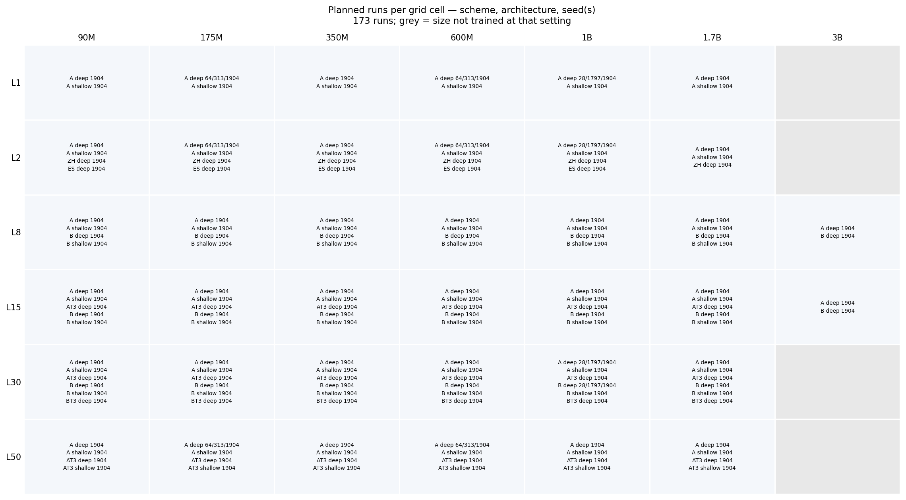
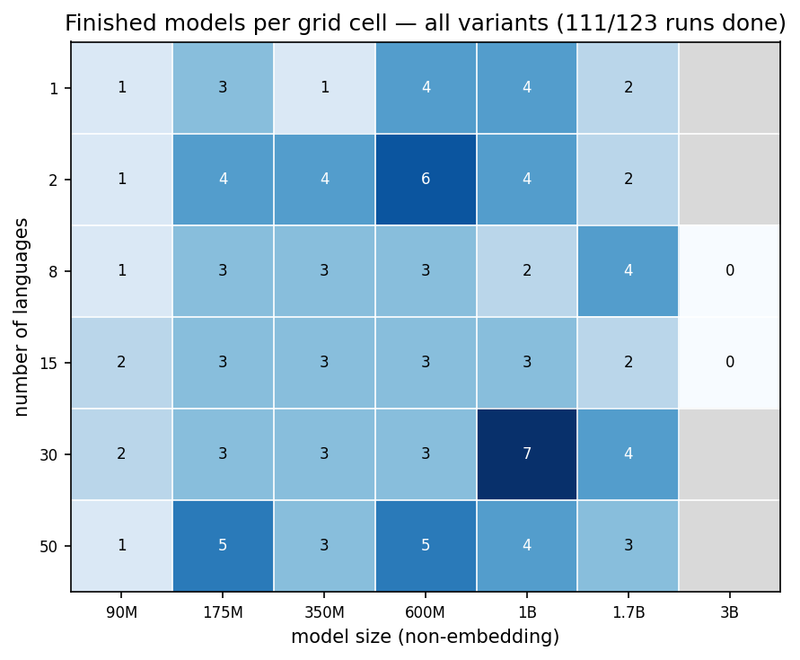
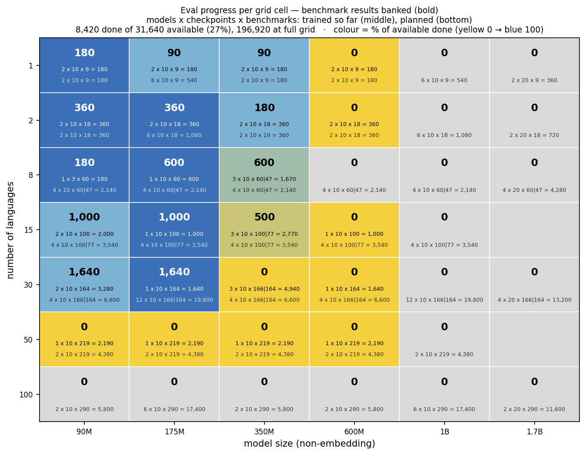

# Multilingual small-to-large predictivity: training plan

## Goal

Find which model sizes and token budgets can serve as proxies for comparing design choices, and how that depends on the number of languages. Concretely: at a given number of languages, when does a small model rank a design choice the way a large model does? This study is not meant to predict Apertus 2's absolute performance; it is meant to tell us which proxy settings are reliable for making Apertus 2 design decisions when the dataset consists of a given number of languages.

The number of languages and the model size are the axes being analyzed, so neither is the design choice that's altered within a given model setting (i.e., they are not the factors being varied for the sake of model comparison/ranking). The design choice is varied as a separate intervention with at least three levels (see the intervention section). The outcome metric is per-language bits-per-byte (BPB) on a fixed held-out validation set.

## Parameter-count convention

All model sizes below are **non-embedding parameters**: the transformer width and depth only, excluding the token embedding and output-projection matrices.

This follows the Signal-and-Noise paper (Heineman et al., 2025), which uses the Bhagia et al. (2024) compute-efficient model ladder. That ladder defines its sizes (190M, 370M, 760M, 1.3B) "considering only non-embedding parameters," varying width and depth, and sets training tokens as multiples of Chinchilla-optimal (1×C = 20N). We use the same convention because the 131K Apertus vocabulary makes the embedding and output-projection matrices roughly 130–270M parameters on their own, which would otherwise account for most of the parameters in the small models and distort both the size axis and the scaling-law fit.

We should set the Megatron width and depth to hit each non-embedding target. The public OLMo-ladder configs (190M, 370M, 760M, 1.3B) are a close template for four of the sizes; aligning those four to the published values would let you reuse the configs and match the Signal-and-Noise setup directly.

Compute-planning note: with a 131K vocabulary, the output projection costs about 2·d_model·V floating-point operations per token, which roughly doubles the per-token cost of the smallest models relative to their non-embedding parameter count.

## Models

Sizes are non-embedding parameters. Cells marked ×3 get three seeds (different initialization and data-order seed); the rest get one seed.

| Languages | 90M | 175M | 350M | 600M | 1B  | 1.7B |
| --------- | --- | ---- | ---- | ---- | --- | ---- |
| 1         | ✓   | ×3   | ✓    | ✓    | ×3  | ✓    |
| 2         | ✓   | ✓    | ✓    | ✓    | ✓   | ✓    |
| 8         | ✓   | ✓    | ✓    | ✓    | ✓   | ✓    |
| 15        | ✓   | ✓    | ✓    | ✓    | ✓   | —    |
| 30        | ✓   | ×3   | ✓    | ✓    | ×3  | ✓    |
| 50        | ✓   | ✓    | ✓    | ✓    | ✓   | —    |
| 100       | ✓   | ×3   | ✓    | ✓    | ×3  | ✓    |

<!-- BEGIN generated: pretrain_progress.py --plot -->
| Axis | Values |
| ---- | ------ |
| Size (non-embedding) | 90M, 175M, 350M, 600M, 1B, 1.7B (1.7B at L ∈ {1, 2, 8, 30, 100}) |
| Language setting L | 1, 2, 8, 15, 30, 50, 100 (English + L−1 FineWeb-2 languages; L=1 is 100% English) |
| Seed | 1904; ×3 seeds (28, 1797, 1904) on the 175M, 1B columns at L ∈ {1, 2, 30, 100} |
| Data scheme | A everywhere; B only where its language set differs — L ∈ {8, 15, 30} |
| Architecture | deep (baseline) and shallow (the model-depth intervention) |

**56 runs** at one intervention level (scheme A, deep — the plan grid).
Counting both architectures and scheme B where it differs: **154 runs**.






<!-- END generated -->

(The 200-language setting was dropped on 2026-08-13 to fit the compute budget
and deadline. The ×3-seed rows were 1, 30 and 100; L=2 was added to them, and
the 1.7B row gained L=2, taking the grid from 52 to 56.)

## Intervention axis (the design choice under test)

Each (model size, number-of-languages) cell is trained under at least three different settings (an "intervention"). The analysis asks whether a proxy (smaller models) ranks those levels the way the reference (a larger model) does. The reference at each number of languages is the largest model trained there.

### Possible interventions

- **Tokenizer**, original (swiss-ai/Apertus-70B-2509) versus the V2 candidate vs. one of the others Clara has trained that's the same size. BPB is comparable across tokenizers because its denominator is bytes, so the metric needs no change.
- **Model depth**, comparing a deeper-narrower against a shallower-wider model at the same non-embedding size. This is the most controlled option (same data, same tokenizer, same size), but the effect of aspect ratio on loss is usually small near the optimum, so the signal may be too weak to estimate decision accuracy. Use it only if you expect a clear effect at these sizes.
- **Sampling temperature**, comparing T = 1 against about larger values. This is the most multilingual-specific choice and the one most likely to show a ranking that flips with scale, since the optimal temperature shifts with capacity and the number of languages. The two levels train on different distributions and the winner depends on how you aggregate across languages, so fix the decision criterion first; it is also only meaningful above one language.

## Token budget

The token budget is set per model size, and held constant across all language settings for a given size. Each size trains on 5× Chinchilla-optimal:

D(N) = 5 × 20 × N = 100 × N (non-embedding N).

| Size (non-emb) | 1×C = 20N | D(N) = 5×C |
| -------------- | --------- | ---------- |
| 90M            | 1.8B      | 9B         |
| 175M           | 3.5B      | 17.5B      |
| 350M           | 7B        | 35B        |
| 600M           | 12B       | 60B        |
| 1B             | 20B       | 100B       |
| 1.7B           | 34B       | 170B       |

Compute the exact token count for each model from its actual non-embedding parameter count (D = 100 × N).

Reasoning:

- A fixed multiple of Chinchilla per size is the standard scaling-ladder setup (Bhagia et al. train each rung at 1×–10×C; DataDecide uses 5×C for data decisions). Holding the same multiple across sizes keeps every rung in the same training regime, which is what the scaling-law fit over size needs.
- The 5× multiple puts the ~2B-scale model near 200B tokens, inside ATLAS's empirical pretrain-versus-finetune crossover band for ~2B multilingual models (about 144–283B), so the largest models are adequately trained for 200 languages.
- Holding D constant across language settings for a given size means that, within a size, only the language mix changes between settings. Differences then come from the number of languages and the per-language token reduction, not from a changing token count.

## Data mixtures

- **Sources:** FineWeb2 for the non-English languages. Ayush recommended using the hq variant at fineweb2-hq. English from `dclm-edu-filterrobots_fine` (there is no eng_Latn in FineWeb2). Default tokenizer: swiss-ai/Apertus-70B-2509 (the V1 tokenizer).
- **English share:** 50% in every multilingual setting; the other 50% is the FineWeb2 languages. The 1-language setting is 100% English. (See open question 2.)
- **Allocation within the FineWeb2 50%:** temperature sampling with T = 1 by default (proportional to estimated per-language tokens). (See open question 1.)
- **Language counts include English,** so the FineWeb2 language list for an L-setting has L − 1 entries. The lists are nested: the 1-language FineWeb2 list is a subset of the 7-language list, which is a subset of the 14-, 29-, 49-, and 99-language lists, all drawn from the 199 FineWeb2 languages used in the prior 200-language run. The validation build covers the 99-language list plus English (the largest trained setting). The 29 FineWeb2 languages in the 30-setting are the TokEval set minus English.

To avoid tokenizing English once per setting, build the English data once and the FineWeb2 data once per setting, then blend them 50/50 at training time with the Megatron data loader's blend weights. So the artifacts are: one English dataset, one FineWeb2 dataset per multilingual setting, and one fixed validation set.

| Setting (L) | FineWeb2 languages | FineWeb2 build tokens | English share at training time |
| ----------- | ------------------ | --------------------- | ------------------------------ |
| 1           | 0 (English only)   | —                     | 100%                           |
| 2           | 1                  | 55B                   | 50%                            |
| 8           | 7                  | 93.5B                 | 50%                            |
| 15          | 14                 | 55B                   | 50%                            |
| 30          | 29                 | 93.5B                 | 50%                            |
| 50          | 49                 | 55B                   | 50%                            |
| 100         | 99                 | 93.5B                 | 50%                            |

Each FineWeb2 build is sized to half of the largest budget at that setting, with about 10% headroom: 93.5B where a 1.7B model trains (settings 8, 30, 100; half of 170B plus headroom), 55B otherwise (half of 100B plus headroom). The English dataset is built once to 187B, which covers the 1-language setting's largest need (170B) and the English half of every other setting. The build script reports the realized per-language token counts and warns when a language runs out of data; record any shortfall.

## Validation set

Build one validation set, fixed and independent of temperature, token budget, and the language set, reused by every model. For each language, the validation set is the first 5M tokens of that language's first parquet file, capped at 30% of that file's rows so that single-file languages keep training data. The build records, per language, the token count, the UTF-8 byte count (the BPB denominator), and the number of leading rows assigned to validation (val_doc_count). Every training build is given this manifest and skips exactly those leading rows of the first file, so training and validation never overlap. This handles single-file languages, which exist in the tail.

Build it once over the 99-language list (the largest trained setting) plus English. A language whose first file is a single document gets no validation data and is flagged by the script.

## Commands

Run paths and `--output_prefix` values are placeholders; adjust to the cluster layout. The `$FW_Lx` placeholders are the FineWeb2 language lists described above (`$FW_L2` has 1 language, `$FW_L8` has 7, `$FW_L15` has 14, `$FW_L30` has 29, `$FW_L50` has 49, `$FW_L100` has 99), each a comma-separated list of `{lang}_{script}` codes with no spaces.

### Step 1: build the validation set (once)

```bash
python create_data_mixture.py \
  --build_validation \
  --languages $FW_L100 \
  --val_tokens_per_language 5000000 \
  --val_max_fraction 0.3 \
  --output_prefix outputs/validation
```

This writes `outputs/validation.fineweb_<lang>.bin`/`.idx` per language, `outputs/validation.dclm.bin`/`.idx` for English, and `outputs/validation.manifest.json` (per-language tokens, bytes, and val_doc_count). English is included automatically and does not need to be in `$FW_L100`.

### Step 2: build the English dataset (once)

```bash
python create_data_mixture.py \
  --target_tokens 187000000000 \
  --fineweb_pct 0 --dclm_pct 100 \
  --validation_manifest outputs/validation.manifest.json \
  --output_prefix outputs/english_dclm
```

### Step 3: build the FineWeb2 dataset per setting

Each uses `--fineweb_pct 100 --dclm_pct 0`, `--temperature 1.0`, and the validation manifest. The 1-language setting has no FineWeb2 build; it trains on the English dataset alone.

**L = 2:**

```bash
python create_data_mixture.py \
  --target_tokens 55000000000 \
  --fineweb_pct 100 --dclm_pct 0 \
  --languages $FW_L2 \
  --temperature 1.0 \
  --validation_manifest outputs/validation.manifest.json \
  --output_prefix outputs/fineweb_L2
```

**L = 8:**

```bash
python create_data_mixture.py \
  --target_tokens 93500000000 \
  --fineweb_pct 100 --dclm_pct 0 \
  --languages $FW_L8 \
  --temperature 1.0 \
  --validation_manifest outputs/validation.manifest.json \
  --output_prefix outputs/fineweb_L8
```

**L = 15:**

```bash
python create_data_mixture.py \
  --target_tokens 55000000000 \
  --fineweb_pct 100 --dclm_pct 0 \
  --languages $FW_L15 \
  --temperature 1.0 \
  --validation_manifest outputs/validation.manifest.json \
  --output_prefix outputs/fineweb_L15
```

**L = 30:**

```bash
python create_data_mixture.py \
  --target_tokens 93500000000 \
  --fineweb_pct 100 --dclm_pct 0 \
  --languages $FW_L30 \
  --temperature 1.0 \
  --validation_manifest outputs/validation.manifest.json \
  --output_prefix outputs/fineweb_L30
```

**L = 50:**

```bash
python create_data_mixture.py \
  --target_tokens 55000000000 \
  --fineweb_pct 100 --dclm_pct 0 \
  --languages $FW_L50 \
  --temperature 1.0 \
  --validation_manifest outputs/validation.manifest.json \
  --output_prefix outputs/fineweb_L50
```

**L = 100:**

```bash
python create_data_mixture.py \
  --target_tokens 93500000000 \
  --fineweb_pct 100 --dclm_pct 0 \
  --languages $FW_L100 \
  --temperature 1.0 \
  --validation_manifest outputs/validation.manifest.json \
  --output_prefix outputs/fineweb_L100
```

## Training

For each (size, setting), train for D(N) tokens (the per-size budget above). Compose the data at training time with the Megatron data loader:

- **1-language setting:** the English dataset alone (weight 1.0).
- **Multilingual settings:** the English dataset and that setting's FineWeb2 dataset, blended 50/50.

Set the trainer's total token count to D(N) for each size. The largest model at a setting trains close to one pass over the blended data; the smaller models draw a fraction, which the loader's shuffling makes a proportional sample. Seeds re-run with a different initialization and data-order seed, drawing a different sample. If exact per-language training token counts at every size matter more than tokenizer time, build a separate dataset per (size, setting) instead of subsampling one; that costs more tokenization.

Before the largest run at a setting, check the realized FineWeb2 build size that the script reports. At high language counts lower-resource languages can run out, so the realized size can fall below the build target; if it is below the largest model's FineWeb2 half (85B at the 1.7B settings), reduce that model's token count to avoid repeating data, and record it.

Log the final checkpoints (for example the last 30, spaced about 1000 steps), so that per-language BPB and the checkpoint-to-checkpoint noise estimate can be computed over the final window, matching the Signal-and-Noise noise definition.

**As implemented (2026-08-21).** Each run saves **20 checkpoints** evenly spaced (40 at 1.7B, whose interval stays near the ~2000-iter Azure-spot eviction window). The interval is per size, `train_iters / 20`, so checkpoint *k* sits at *k*/20 of training at **every** size — the grids are index-aligned across the ladder, which is what lets SNR compare checkpoint *k* between sizes. Because D = 5 × Chinchilla, the 1×C operating point (`train_iters / 5`) is always checkpoint 4 (8 of 40), on-grid at every size. Evaluation covers every 2nd checkpoint **plus the last 5**, so the late-training window that checkpoint-noise is computed over is sampled densely.

Note the deviation from "the last 30": with 20 checkpoints per run the whole grid is smaller than that, and the dense tail is 5. Checkpoint noise is therefore estimated over 5 late checkpoints, not 30. Raising it means lowering the save interval — cheap in compute (checkpoints are written by training anyway) but it multiplies conversion and eval volume, which is the actual constraint (see `plan/compute-budget.md`).

## Checkpointing at defined token counts

Save checkpoints at several token counts within each run, not only at the end, so per-language BPB can be read at defined operating points and fit over training tokens as well as over model size. Two reference points are useful for each (size, language count):

1. **The single-language Chinchilla-optimal point,** 20 × N (non-embedding N). It depends only on model size: 90M → 1.8B, 175M → 3.5B, 350M → 7B, 600M → 12B, 1B → 20B, 1.7B → 34B. It is within the 5×C training budget for every size, so it is always an intermediate checkpoint.
2. **The ATLAS compute-optimal point** for that model size and language count, N × r(K). ATLAS reports that adding languages without degrading per-language loss scales model size by 1.18 and total tokens by 1.66 per doubling of the language count (their worked case: one to four languages is ×1.4 model size and ×2.74 total tokens). The compute-optimal tokens-per-parameter ratio therefore grows by 1.66/1.18 ≈ 1.41 per doubling, anchored at 20 (Chinchilla) for one language: r(K) = 20 × 1.41^log2(K). This is approximate and should be double-checked.

r(K), tokens per parameter:

| K    | 1   | 2   | 8   | 15  | 30  | 50  | 100 |
| ---- | --- | --- | --- | --- | --- | --- | --- |
| r(K) | 20  | 28  | 56  | 76  | 107 | 137 | 193 |

ATLAS compute-optimal tokens, N × r(K), in billions:

| Size | 1    | 2    | 8    | 15   | 30   | 50   | 100  |
| ---- | ---- | ---- | ---- | ---- | ---- | ---- | ---- |
| 90M  | 1.8  | 2.5  | 5.0  | 6.8  | 9.6  | 12.4 | 17.4 |
| 175M | 3.5  | 4.9  | 9.7  | 13.3 | 18.7 | 24.0 | 33.8 |
| 350M | 7.0  | 9.8  | 19.5 | 26.6 | 37.4 | 48.1 | 67.6 |
| 600M | 12.0 | 16.9 | 33.4 | 45.5 | 64.1 | 82.4 | 116  |
| 1B   | 20.0 | 28.1 | 55.7 | 75.9 | 107  | 137  | 193  |
| 1.7B | 34.0 | 47.8 | 94.7 | 129  | 182  | 234  | 328  |

The K = 1 column is the single-language Chinchilla point. Cells at K ≥ 30 exceed the 5×C training budget (r(K) > 100 tokens per parameter), so training to 5×C does not reach the ATLAS compute-optimal point there: to capture that checkpoint at 30 languages and above, extend those runs to N × r(K), otherwise the final checkpoint is the 5×C budget. At 15 languages and below the ATLAS point is within the budget and is an intermediate checkpoint. Logging a few additional counts per run (for example 1×C and 2×C) gives several token points for the fit.

## Evaluation

Per-language BPB on the fixed validation set, using the same per-language text for every model. For each language, BPB = (sum of per-token negative log-likelihood in bits) / (validation bytes for that language), with the byte counts taken from the validation manifest. Evaluate each model on the languages it was trained on. Optionally, also evaluate each model on languages it was not trained on (the validation set covers all 199 plus English), which gives a zero-shot cross-lingual transfer read at no extra training cost.

## Analysis

The goal is to find which model sizes and token budgets rank a design choice the way the largest model does, and how that depends on the number of languages.

### Ranking stability (decision accuracy)

At each number of languages, both intervention levels are trained at every size. For each proxy size, compare its ordering of the levels against the largest model's ordering at the same number of languages. With a two-level intervention, the ordering is one decision per language, so the languages provide the population: decision accuracy at a (proxy size, language count) is the fraction of languages where the proxy and the reference agree on which level is better. Map this over proxy size and number of languages to find the smallest reliable proxy at each language count.

Caveats:

- It needs multiple levels (our "design choice intervention") and signal within these levels. If the two levels are close in per-language BPB, the decision is near a coin flip and decision accuracy is low for a reason unrelated to the proxy. Need to measure variability.
- It needs the large reference model trained on the same levels at that number of languages, so it can only be used where a reference size exists.
- Need to choose a criterion: per-language agreement, or agreement on a macro-average across languages. They can disagree...

### Prediction ability

Fit per-language BPB as a function of non-embedding size across scales, and measure how closely the proxy sizes predict the reference's absolute per-language BPB, and how that changes as the number of languages grows.

Caveats:

- It is sensitive to a constant offset. Small models often sit at a fixed distance from large ones in absolute loss even when preserving ordering; the fit then reports large error even when every decision the proxy implies is correct. Prediction error and decision accuracy can point in opposite directions.
- It assumes a functional form, which the multilingual bend and the small number of size points can break.
- Absolute per-language BPB spans a wide range across languages, so an aggregate is dominated by the high-BPB low-resource tail unless normalized.

## Open questions

1. Sampling temperature is set to T = 1 (proportional to estimated tokens) by default. Should the FineWeb2 proportion instead be tempered toward uniform (for example alpha = 0.3, i.e. T ≈ 3.3) to give lower-resource languages more weight? Similarly, the datasets are all fixed to 50% English. Is this sound or should it change as languages are added (for example, scaling down with the number of languages)?
2. Still need to make sure we can create Megatron configs for the specific parameter counts we had in mind (maybe Maria already has these, just not 100% sure).
3. 5 × C tokens does not give the ATLAS compute-optimal point for ≥ 30 languages. Should we instead base full dataset sizes on ATLAS numbers for K = 200? This would be a ridiculous number of tokens (462B for the 1.7B model).
4. Which design choice to use as the intervention: tokenizer, model depth, or sampling temperature. If the tokenizer, all data and the validation sets are built once per tokenizer.
